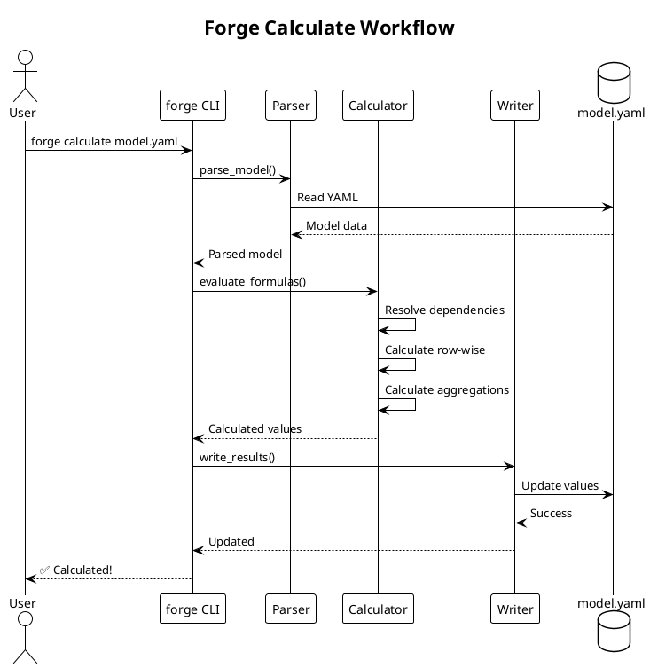
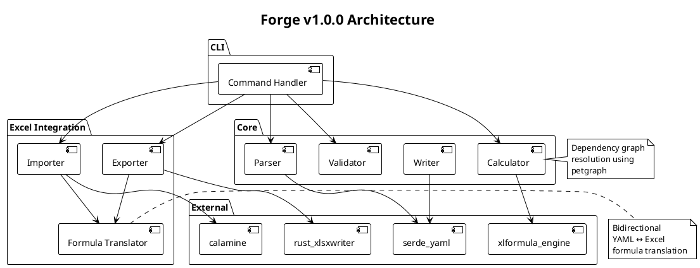
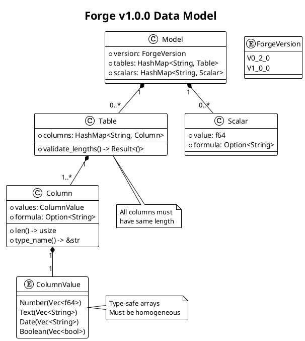
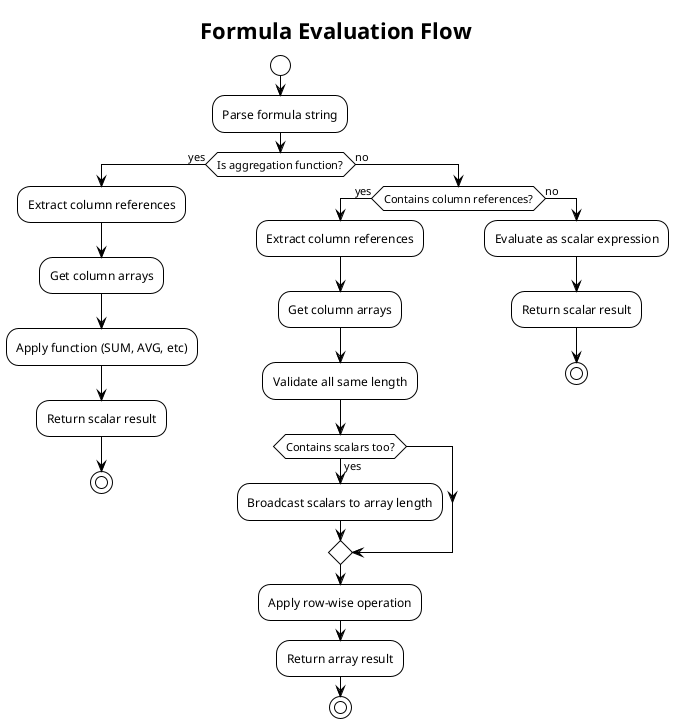

# Forge Diagrams

**Purpose:** Architecture and design diagrams for Forge documentation.

**Format:** PlantUML (.puml files)

**Server:** Public PlantUML server at <https://www.plantuml.com/plantuml>

---

## Quick Start

### Creating a Diagram

1. **Create a .puml file** in this directory:

   ```bash
   touch diagrams/my-diagram.puml
   ```

2. **Write PlantUML syntax** (see examples below)

3. **Validate syntax:**

   ```bash
   make validate-diagrams
   ```

4. **Render to SVG/PNG** (optional, for embedding in docs):

   ```bash
   # Manual rendering via web UI
   # Visit: https://www.plantuml.com/plantuml/uml/
   # Paste your .puml content
   # Download SVG/PNG
   ```

---

## PlantUML Syntax Examples

### Sequence Diagram (User Workflow)



### Component Diagram (Architecture)



### Class Diagram (Data Model)



### Flowchart (Decision Logic)



---

## Validation Workflow

### Automatic Validation

Diagrams are validated automatically via:

```bash
make validate-all        # Includes diagram validation
make validate-diagrams   # Validate diagrams only
make pre-commit          # Full check (includes diagrams)
```

The validation script (`bin/validate-plantuml.sh`) will:

1. Find all `.puml` and `.plantuml` files in `diagrams/`
2. Send each to public PlantUML server
3. Check if syntax is valid (HTTP 200 = valid)
4. Report any errors

### Manual Validation

Visit the PlantUML web editor:

**Web Editor:** <https://www.plantuml.com/plantuml/uml/>

1. Paste your PlantUML code
2. See rendered diagram instantly
3. Download as SVG/PNG if needed

---

## Best Practices

### Naming Conventions

```text
diagrams/
├── architecture-overview.puml          # High-level system view
├── data-model-v1.0.puml               # Version-specific models
├── formula-evaluation-sequence.puml    # Workflow sequences
├── excel-export-flow.puml              # Feature-specific flows
└── README.md                           # This file
```

**Rules:**

- Use kebab-case (lowercase with hyphens)
- Be descriptive (avoid `diagram1.puml`)
- Include version if version-specific (`v1.0`, `v1.1`)
- Group by type: `*-architecture.puml`, `*-sequence.puml`, `*-flow.puml`

### Style Guidelines

1. **Always include title:**

   ```plantuml
   @startuml
   title My Diagram Title
   ```

2. **Use themes for consistency:**

   ```plantuml
   !theme plain  # Recommended for docs
   ```

3. **Add notes for clarity:**

   ```plantuml
   note right of Component
     Explanation of
     complex behavior
   end note
   ```

4. **Keep diagrams focused:**
   - One concept per diagram
   - Split complex diagrams into multiple files
   - Max ~15-20 elements per diagram

5. **Use consistent terminology:**
   - Check `GLOSSARY.md` for canonical terms
   - Use same names as code (e.g., `Calculator` not `Calc`)

### Documentation Links

Always reference diagrams from markdown docs:

```markdown
## Architecture Overview

See the architecture diagram for a visual overview:


Source: [diagrams/architecture-overview.puml](diagrams/architecture-overview.puml)
```

---

## PlantUML Resources

### Official Documentation

- **PlantUML Language Reference:** <https://plantuml.com/guide>
- **Sequence Diagrams:** <https://plantuml.com/sequence-diagram>
- **Class Diagrams:** <https://plantuml.com/class-diagram>
- **Component Diagrams:** <https://plantuml.com/component-diagram>
- **Activity Diagrams:** <https://plantuml.com/activity-diagram-beta>

### Cheat Sheets

- **Diagram Types:** <https://plantuml.com/sitemap-language-specification>
- **Themes:** <https://plantuml.com/theme>
- **Styling:** <https://plantuml.com/skinparam>

### Online Tools

- **Web Editor:** <https://www.plantuml.com/plantuml/uml/>
- **VSCode Extension:** PlantUML (jebbs.plantuml)
- **IntelliJ Plugin:** PlantUML Integration

---

## Common Diagram Types for Forge

### 1. Architecture Diagrams

**When to create:**

- Major version releases (v1.0, v1.2, v2.0)
- Significant architectural changes
- New subsystem additions

**Example:** `architecture-v1.0.puml`, `excel-integration-architecture.puml`

### 2. Sequence Diagrams

**When to create:**

- User workflows (calculate, validate, export, import)
- Cross-component interactions
- Complex feature flows

**Example:** `calculate-workflow-sequence.puml`, `export-with-formulas-sequence.puml`

### 3. Data Model Diagrams

**When to create:**

- New data structures
- Model version changes (v0.2 → v1.0)
- Type system documentation

**Example:** `data-model-v1.0.puml`, `column-value-types.puml`

### 4. Flowcharts

**When to create:**

- Decision logic (formula evaluation, dependency resolution)
- Algorithm explanations
- Error handling flows

**Example:** `formula-evaluation-flow.puml`, `dependency-resolution-flow.puml`

### 5. Deployment Diagrams (Future)

**When to create:**

- Infrastructure setup
- CI/CD pipelines
- Cloud deployment architecture

**Example:** `deployment-architecture.puml`

---

## Troubleshooting

### Validation Fails

**Error:** `❌ PlantUML server unreachable`

**Solution:**

- Check internet connection
- Verify firewall allows HTTPS to `www.plantuml.com`
- Try manual validation: <https://www.plantuml.com/plantuml/uml/>

**Error:** `❌ Failed (HTTP 400)`

**Solution:**

- Syntax error in PlantUML code
- Copy/paste into web editor to see specific error
- Check for:
  - Missing `@startuml` / `@enduml`
  - Unclosed quotes
  - Invalid PlantUML commands

### Diagram Doesn't Render

**Common issues:**

1. **Missing theme:** Add `!theme plain` after `@startuml`
2. **Typo in syntax:** Check PlantUML docs for correct command
3. **Wrong diagram type:** Ensure commands match diagram type (sequence vs class)

---

## Integration with Documentation

### In README.md

```markdown
## Architecture

Forge is built with a modular architecture:


Key components:
- **Parser:** YAML → Internal model
- **Calculator:** Formula evaluation with dependency resolution
- **Writer:** Internal model → YAML
```

### In DESIGN_V1.md

```markdown
## Data Model

The v1.0.0 array model uses type-safe column arrays:


Each table contains homogeneous column arrays...
```

### In SRED_RESEARCH_LOG.md

```markdown
### Dependency Resolution Algorithm

The topological sort algorithm ensures formulas evaluate in correct order:


**Technical Uncertainty:** How to handle circular dependencies...
```

---

## Maintenance

### When to Update Diagrams

**Triggers:**

- Major version releases
- Architecture refactors
- New subsystems added
- Data model changes
- Workflow changes

**Process:**

1. Update `.puml` source file
2. Run `make validate-diagrams`
3. Re-render SVG/PNG if embedded
4. Update referencing documentation
5. Commit `.puml` + rendered images + docs together

### Quarterly Review

Check all diagrams for accuracy:

```bash
# List all diagrams
ls -la diagrams/*.puml

# Validate all
make validate-diagrams
```

Ask:

- Do diagrams match current implementation?
- Are new features documented?
- Are deprecated features removed?

---

## Future Enhancements

### Potential Additions

1. **Mermaid.js support** (GitHub/GitLab native)
2. **Auto-rendering** (generate SVG/PNG automatically)
3. **CI/CD integration** (validate diagrams on PR)
4. **Diagram linting** (enforce style rules)

### Current Limitations

- Manual SVG/PNG rendering (no automation yet)
- Public server dependency (no offline validation)
- No diff visualization for diagram changes

---

**Last updated:** 2025-11-24
**PlantUML Server:** <https://www.plantuml.com/plantuml>
**Validation Script:** `bin/validate-plantuml.sh`
