# Autonomous Session Guide

## How to Work with Claude AI on Forge

> "Run warmup, say 'punch it', go grab a coffee. Come back to a release."

---

## Quick Start

```bash
# Start a session
You: "run warmup"

# Claude presents the next milestone
Claude: "📋 NEXT MILESTONE: Add XLOOKUP function support..."

# Confirm to start autonomous execution
You: "punch it"

# Go do something else. Claude works autonomously.
# Come back to a fully released version.
```text

That's it. Really.

---

## The Full Flow

```mermaid
sequenceDiagram
    participant U as You
    participant C as Claude
    participant G as GitHub
    participant L as Local
    participant R as crates.io

    U->>C: "run warmup"
    C->>C: Read warmup.yaml (HOW)
    C->>C: Read sprint.yaml (WHEN)
    C->>C: Read roadmap.yaml (WHAT)
    C->>U: Present next milestone
    U->>C: "punch it" / "go" / "hit it"

    Note over C: 🤖 AUTONOMOUS MODE
    Note over C: (sprint.yaml enforced)
    C->>C: Implement feature
    C->>C: Write tests
    C->>C: Update docs
    C->>C: Run all checks

    Note over C: 📦 RELEASE
    C->>G: git push + tag
    C->>L: make install-user
    C->>R: cargo publish

    C->>U: ✅ RELEASE COMPLETE: vX.Y.Z
```



---

## Step-by-Step

### Step 1: Trigger the Session

Say any of these:

| Trigger Phrase | Effect |
|----------------|--------|
| `run warmup` | Standard session start |
| `run warmup protocol` | Same as above |
| `warmup` | Same as above |
| `start session` | Same as above |

Claude will:

1. Read `warmup.yaml` (HOW to develop)
2. Read `sprint.yaml` (WHEN to stop)
3. Read `roadmap.yaml` (find next milestone)
4. Check git status
5. Load essential context

### Step 2: Review the Milestone

Claude presents something like:

```text
📋 NEXT MILESTONE: Add XLOOKUP function support
━━━━━━━━━━━━━━━━━━━━━━━━━━━━━━━━━━━━━━━━━━━━━━━━
Scope: Implement Excel XLOOKUP with all options
Estimated: 3 hours
Deliverables:
  - XLOOKUP parsing and evaluation
  - Support for match_mode and search_mode
  - 20+ unit tests
  - E2E test with real YAML file
  - README examples

Release targets:
  ☐ GitHub (commit + tag + push)
  ☐ Local install (make install-user)
  ☐ crates.io (cargo publish)

Say "go", "run", "hit it", or "punch it" to start autonomous execution.
Say "skip" to pick a different milestone.
Say "plan" to discuss the approach first.
```text

### Step 3: Confirm or Redirect

| You Say | What Happens |
|---------|--------------|
| `go` | Start autonomous execution |
| `hit it` | Start autonomous execution |
| `punch it` | Start autonomous execution |
| `ship it` | Start autonomous execution |
| `do it` | Start autonomous execution |
| `yes` / `y` | Start autonomous execution |
| `skip` | Claude presents alternative milestones |
| `plan` | Claude discusses approach before starting |
| (ask a question) | Claude answers, then re-presents |

### Step 4: Autonomous Execution

Once you confirm, Claude enters **autonomous mode**:

```text
🤖 AUTONOMOUS MODE ACTIVATED

From this point until release, Claude works WITHOUT interruption.
```text

**What Claude does:**

- Makes all technical decisions independently
- Writes code, tests, documentation
- Fixes any issues that arise
- Updates TodoWrite to show progress
- Does NOT ask questions (uses best judgment)
- Does NOT wait for approval

**Claude only interrupts if:**

- Blocked by external dependency (missing API key, etc.)
- Fundamental requirement ambiguity
- Approaching 4-hour limit without completion

**You can:**

- Watch progress in real-time
- Go do something else entirely
- Trust the process

### Step 5: Release

Claude releases to ALL targets:

```bash
# GitHub
git add -A
git commit -m "chore: Release vX.Y.Z - [milestone]"
git tag vX.Y.Z
git push origin main
git push origin vX.Y.Z

# Local
make install-user
forge --version  # Verify

# crates.io
cargo publish
# Verify: https://crates.io/crates/royalbit-forge
```text

### Step 6: Report

Claude reports completion:

```text
✅ RELEASE COMPLETE: v2.1.0
━━━━━━━━━━━━━━━━━━━━━━━━━━━━━━━━━━━━━━━━━━━━━━━━
Milestone: Add XLOOKUP function support
Duration: 2 hours 45 minutes

Deliverables:
  ✅ XLOOKUP parsing and evaluation
  ✅ Support for match_mode and search_mode
  ✅ 23 unit tests
  ✅ E2E test in test-data/xlookup-test.yaml
  ✅ README examples added

Release targets:
  ✅ GitHub: abc1234 tagged v2.1.0
  ✅ Local: forge v2.1.0 installed
  ✅ crates.io: https://crates.io/crates/royalbit-forge/2.1.0

Tests: 193 passing, ZERO warnings

Session logged in AI_DEVELOPMENT_HOURS.md
```text

---

## Quality Guarantees

Every autonomous session guarantees:

| Guarantee | Enforcement |
|-----------|-------------|
| **ZERO warnings** | `cargo clippy` + `markdownlint` + `yamllint` |
| **All tests pass** | `cargo test` must succeed |
| **Docs updated** | README, CHANGELOG, architecture docs |
| **Version bumped** | Cargo.toml version incremented |
| **Tagged release** | Git tag in vX.Y.Z format |
| **Triple publish** | GitHub + Local + crates.io |

If any check fails, Claude fixes it before releasing.

---

## Customizing the Milestone

### Skip to Different Milestone

```text
You: "run warmup"
Claude: "📋 NEXT MILESTONE: Add XLOOKUP..."
You: "skip"
Claude: "Here are alternative milestones:
  1. Fix CSV export bug
  2. Add SUMPRODUCT function
  3. Improve error messages
  Which one?"
You: "2"
Claude: "📋 NEXT MILESTONE: Add SUMPRODUCT..."
```text

### Request Specific Work

```text
You: "run warmup"
Claude: "📋 NEXT MILESTONE: Add XLOOKUP..."
You: "Actually, I need you to fix issue #42 first"
Claude: "📋 REVISED MILESTONE: Fix issue #42..."
You: "punch it"
```text

### Plan Before Executing

```text
You: "run warmup"
Claude: "📋 NEXT MILESTONE: Add pivot table support..."
You: "plan"
Claude: "Let me outline my approach:
  1. Research Excel pivot table structure
  2. Design YAML representation
  3. Implement parser...
  Does this approach work?"
You: "Yes, but use the xlsxwriter crate"
Claude: "Updated plan with xlsxwriter. Ready?"
You: "go"
```text

---

## Tips for Best Results

### Do

- ✅ Let Claude finish (don't interrupt mid-execution)
- ✅ Trust the process (Claude follows strict quality gates)
- ✅ Review the completion report
- ✅ Test the installed version yourself
- ✅ Provide feedback for next session

### Don't

- ❌ Interrupt with "also add X" mid-session (scope creep)
- ❌ Override quality checks ("skip the tests")
- ❌ Request unbounded work ("implement everything")
- ❌ Expect instant responses during execution

### Session Duration

| Session Type | Duration | Use For |
|--------------|----------|---------|
| **Sprint** | 2-4 hours | Full features, major fixes |
| **Micro** | 30min-1hr | Bug fixes, small enhancements |
| **Research** | 1-2 hours | Investigation, planning |

Claude will warn if approaching 4-hour limit.

---

## Surviving /compact

When Claude Code CLI runs `/compact`, context is compressed. The essential protocol survives via the `compact_survival` section in warmup.yaml:

**Always retained:**

- ZERO warnings policy
- Release to ALL targets
- 4-hour maximum
- ONE milestone per session
- Essential file locations
- Release commands

If context seems lost after `/compact`, just say "run warmup" again.

---

## Troubleshooting

### "Claude seems confused about the project"

```text
You: "run warmup"
```text

This reloads all context from warmup.yaml.

### "Claude is asking too many questions"

The protocol says Claude should NOT ask questions during autonomous execution. If this happens:

```text
You: "Remember: autonomous mode means no questions. Use your best judgment."
```text

### "Release failed partway through"

Claude should retry automatically. If not:

```text
You: "Continue the release - we stopped at [step]"
```text

### "I need to abort mid-session"

```text
You: "STOP. Do not continue. Do not release."
```text

Claude will halt and await instructions.

---

## The Protocol Files

| File | Purpose |
|------|---------|
| `warmup.yaml` | Master protocol (quality standards, workflow, rules) |
| `roadmap.yaml` | Milestone definitions and priorities |
| `docs/SPRINT_AUTONOMY_PROTOCOL.md` | Bounded session methodology |
| `docs/AUTONOMOUS_STORY.md` | History of AI autonomous development |

---

## Philosophy

> "The future of software isn't 'AI helps developers'. It's 'AI IS developers'."

The autonomous session model treats Claude as a **developer**, not an assistant:

- Claude owns technical decisions
- Claude ships complete features
- Claude maintains quality standards
- Human provides direction, not supervision

The warmup protocol + sprint autonomy = **sustainable AI development** that actually ships.

---

## Quick Reference Card

| Command | Action |
|---------|--------|
| `run warmup` | Start session |
| `go` / `hit it` / `punch it` | Confirm and execute |
| `skip` | Different milestone |
| `plan` | Discuss first |
| `STOP` | Abort session |

**Guarantees:** ZERO warnings, all tests pass, docs updated, triple release (GitHub + Local + crates.io)

**Duration:** 2-4 hours max per session

---

> "Run warmup, say 'punch it', go grab a coffee. Come back to a release."

*Welcome to autonomous AI development.*
