# Forge Features

Complete reference for all Forge capabilities (v2.0.0).

---

## Core Features

### Formula Evaluation

- **Row-wise formulas**: `=revenue - expenses` (applies to each row)
- **Aggregation formulas**: `=SUM(revenue)`, `=AVERAGE(profit)`
- **Cross-table references**: `=pl_2025.revenue`
- **Array indexing**: `revenue[3]`
- **Nested functions**: `=ROUND(SQRT(revenue), 2)`

### 57+ Excel-Compatible Functions

```mermaid
graph LR
    subgraph Aggregation
        A[SUM] --> B[AVERAGE]
        B --> C[MAX/MIN]
        C --> D[COUNT]
        D --> E[PRODUCT]
    end

    subgraph Conditional
        F[SUMIF] --> G[COUNTIF]
        G --> H[AVERAGEIF]
        H --> I[SUMIFS/COUNTIFS]
        I --> J[MAXIFS/MINIFS]
    end

    subgraph Lookup
        K[INDEX] --> L[MATCH]
        L --> M[XLOOKUP]
        M --> N[VLOOKUP]
    end

    subgraph Financial
        O[NPV] --> P[IRR]
        P --> Q[PMT/FV/PV]
        Q --> R[RATE/NPER]
    end

    subgraph Math
        S[ROUND] --> T[CEILING/FLOOR]
        T --> U[MOD/SQRT/POWER]
    end

    subgraph Text
        V[CONCAT] --> W[TRIM]
        W --> X[UPPER/LOWER]
        X --> Y[LEN/MID]
    end

    subgraph Date
        Z[TODAY] --> AA[DATE]
        AA --> AB[YEAR/MONTH/DAY]
    end
```



**v1.6.0 Financial Functions (7 new):**

| Function | Description | Example |
|----------|-------------|---------|
| `NPV(rate, values)` | Net Present Value | `=NPV(0.1, cash_flows)` |
| `IRR(values)` | Internal Rate of Return | `=IRR(cash_flows)` |
| `PMT(rate, nper, pv)` | Payment calculation | `=PMT(0.05/12, 360, 200000)` |
| `FV(rate, nper, pmt)` | Future Value | `=FV(0.08, 10, -1000)` |
| `PV(rate, nper, pmt)` | Present Value | `=PV(0.06, 5, -1000)` |
| `RATE(nper, pmt, pv)` | Interest rate finder | `=RATE(360, -1000, 200000)` |
| `NPER(rate, pmt, pv)` | Number of periods | `=NPER(0.05/12, -500, 20000)` |

**v1.2.0 Lookup Functions (4):**

- INDEX, MATCH, XLOOKUP, VLOOKUP

**v1.1.0 Functions (27):**

- Conditional: SUMIF, COUNTIF, AVERAGEIF, SUMIFS, COUNTIFS, AVERAGEIFS, MAXIFS, MINIFS
- Math: ROUND, ROUNDUP, ROUNDDOWN, CEILING, FLOOR, MOD, SQRT, POWER
- Text: CONCAT, TRIM, UPPER, LOWER, LEN, MID
- Date: TODAY, DATE, YEAR, MONTH, DAY

**v1.0.0 Functions:**

- Aggregation: SUM, AVERAGE, MAX, MIN, COUNT, PRODUCT
- Logical: IF, AND, OR, NOT, XOR
- Math: ABS

---

## Enterprise Features (v2.0.0)

### HTTP REST API Server

Run `forge-server` for production HTTP API:

```bash
forge-server --host 0.0.0.0 --port 8080
```

**Endpoints:**

| Endpoint | Method | Description |
|----------|--------|-------------|
| `/api/v1/validate` | POST | Validate YAML models |
| `/api/v1/calculate` | POST | Calculate formulas |
| `/api/v1/audit` | POST | Audit variable dependencies |
| `/api/v1/export` | POST | Export to Excel |
| `/api/v1/import` | POST | Import from Excel |
| `/health` | GET | Health check |
| `/version` | GET | Server version |

**Example:**

```bash
curl -X POST http://localhost:8080/api/v1/validate \
  -H "Content-Type: application/json" \
  -d '{"file_path": "model.yaml"}'
```

**Response:**

```json
{
  "success": true,
  "request_id": "550e8400-e29b-41d4-a716-446655440000",
  "data": {
    "valid": true,
    "file_path": "model.yaml",
    "message": "Validation successful"
  }
}
```

---

## AI Integration (v1.7.0)

### MCP Server

Model Context Protocol server for AI agents:

```bash
forge-mcp  # Runs JSON-RPC over stdin/stdout
```

**Claude Desktop Configuration:**

```json
{
  "mcpServers": {
    "forge": {
      "command": "forge-mcp"
    }
  }
}
```

**Available Tools:**

- `forge_validate` - Validate YAML models
- `forge_calculate` - Calculate formulas
- `forge_audit` - Audit dependencies
- `forge_export` - Export to Excel
- `forge_import` - Import from Excel

---

## Developer Tools (v1.4.0-v1.5.0)

### Watch Mode

Real-time file monitoring:

```bash
forge watch model.yaml           # Watch single file
forge watch .                    # Watch all YAML files
forge watch model.yaml --calculate  # Auto-calculate on save
```

### Audit Trail

Dependency chain visualization:

```bash
forge audit model.yaml total_profit
```

Output:

```
Audit trail for 'total_profit':

total_profit
├── =revenue - expenses
├── revenue (from: pl_2025)
│   └── [100000, 120000, 150000]
└── expenses (from: pl_2025)
    └── [80000, 90000, 100000]

Calculated value: [20000, 30000, 50000]
```

### LSP Server

Language Server Protocol for editors:

```bash
forge-lsp  # Runs LSP over stdin/stdout
```

**Features:**

- Real-time validation diagnostics
- Formula error highlighting
- Hover information
- Cross-reference detection

### Editor Extensions

**VSCode:**

- Install from marketplace: "Forge YAML"
- Real-time validation
- Formula syntax highlighting

**Zed:**

- Install from extensions: "forge"
- Native LSP integration

---

## Excel Integration

### Export (`forge export`)

```bash
forge export model.yaml output.xlsx
```

- YAML tables → Excel worksheets
- Formulas preserved and translated
- Cross-table references → Sheet references

### Import (`forge import`)

```bash
forge import spreadsheet.xlsx output.yaml
```

- Excel worksheets → YAML tables
- Formulas reverse-translated
- Round-trip verified

---

## Type System

**Column Types:**

| Type | Example | Notes |
|------|---------|-------|
| Numbers | `[100, 200, 300]` | f64 precision |
| Text | `["Q1", "Q2", "Q3"]` | UTF-8 strings |
| Dates | `["2025-01", "2025-02"]` | YYYY-MM format |
| Booleans | `[true, false, true]` | Logical values |

**Type Safety:**

- Homogeneous arrays (no mixed types)
- Compile-time validation
- Rust memory safety guarantees

---

## Performance

| Operation | Time | Notes |
|-----------|------|-------|
| Validation | <200ms | 850 formulas |
| Calculation | <200ms | Complex models |
| Export | <500ms | 10 worksheets |
| Import | <500ms | 10 worksheets |

**Zero tokens**: All operations run locally.

---

## CI/CD Integration

### GitHub Action

```yaml
name: Validate Models
on: [push, pull_request]

jobs:
  validate:
    runs-on: ubuntu-latest
    steps:
      - uses: actions/checkout@v4
      - uses: royalbit/forge/.github/actions/validate@main
        with:
          files: "models/*.yaml"
```

---

## CLI Reference

```bash
forge validate <file>           # Validate YAML model
forge calculate <file>          # Calculate formulas
forge calculate <file> --dry-run  # Preview without saving
forge audit <file> <variable>   # Show dependency chain
forge export <yaml> <xlsx>      # Export to Excel
forge import <xlsx> <yaml>      # Import from Excel
forge watch <path>              # Watch for changes
forge-lsp                       # Start LSP server
forge-mcp                       # Start MCP server
forge-server                    # Start HTTP API server
```

---

For full documentation, see [README.md](../README.md)
