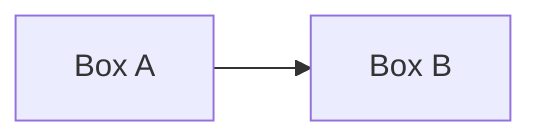

# Mermaid Diagram Guide

Visual documentation for complex systems using GitHub-native Mermaid.

## Critical Rule

**NO ASCII ART DIAGRAMS in documentation!**

```
FORBIDDEN:
┌─────────┐     ┌─────────┐
│  Box A  │────>│  Box B  │
└─────────┘     └─────────┘
```



**Why Mermaid over ASCII:**
- ASCII breaks on different fonts/editors
- ASCII doesn't scale or reflow
- ASCII can't be automatically themed (light/dark)
- Mermaid is GitHub-native, interactive, maintainable

**Exception:** YAML comments can use ASCII since they're not rendered markdown.

## When to Create Diagrams

### Major Versions
- New major release (v1.0, v2.0) - architecture overview
- Significant architectural changes - component diagrams
- New subsystems - integration diagrams

### Complex Features
- Multi-step workflows - sequence diagrams
- Decision logic - flowcharts
- Data model changes - class diagrams

### Documentation
- README needs visual aid - architecture diagram
- DESIGN_V1 explaining algorithms - flow diagram
- SRED explaining novel approach - sequence/component diagram

## Diagram Types

| Type | When to Use | Example |
|------|-------------|---------|
| Flowchart | System architecture, data flow, decision logic | `graph TB` or `graph LR` |
| Sequence | User workflows, cross-component interactions | `sequenceDiagram` |
| Class | Data models, type systems | `classDiagram` |
| ER | Data relationships | `erDiagram` |

## Workflow

1. Embed Mermaid directly in markdown file
2. Use ` ```mermaid ` code fence
3. Preview on GitHub (renders automatically)
4. No separate validation needed (GitHub validates on render)
5. Commit markdown file with embedded diagram

## Best Practices

- Use clear, descriptive node labels
- Add comments with `%%` in Mermaid code
- Check `docs/GLOSSARY.md` for canonical term names
- Keep focused: max 15-20 elements per diagram
- Use subgraphs for logical grouping
- **Use VANILLA Mermaid (no theme/color customization)**

## GitHub Theming Rules

**DO NOT customize themes or colors - breaks GitHub auto-detection**

### What Breaks Auto-Theming
- `%%{init: {'theme': 'dark'}}%%` - theme directives
- `classDef myStyle fill:#90EE90` - custom colors
- `class nodeX myStyle` - applying custom styles

### What is Safe
- Standard shapes: `[]`, `[()]`, `[()]`
- Arrow labels: `-->|text|`
- Subgraphs: `subgraph name`
- Emojis in labels: `['Text']`
- Line breaks: `<br/>`

### Why Vanilla Works
- GitHub auto-detects user's light/dark theme preference
- GitHub applies appropriate colors automatically
- ANY customization overrides this and breaks on one theme
- Vanilla Mermaid = works perfectly on BOTH light and dark

## Resources

- Docs: https://mermaid.js.org/
- Live Editor: https://mermaid.live/
- GitHub Blog: https://github.blog/2022-02-14-include-diagrams-markdown-files-mermaid/
