# Sprint Autonomy Protocol

## AI Development with Bounded Sessions

> "Skynet Mode" - But With an Off Switch

> **📍 Primary Source: [`sprint.yaml`](../sprint.yaml)**
>
> This document is a human-readable guide. The canonical, machine-readable protocol is in `sprint.yaml` at the project root. When in doubt, `sprint.yaml` is the source of truth.

---

## Part of the Forge Protocol Suite

```mermaid
graph TB
    subgraph suite["🔥 FORGE PROTOCOL SUITE"]
        subgraph warmup["WARMUP PROTOCOL<br/>(warmup.yaml)"]
            w1["HOW to develop"]
            w2["• Quality standards"]
            w3["• Coding principles"]
            w4["• Testing requirements"]
            w5["• What 'done' means"]
        end
        subgraph sprint["SPRINT AUTONOMY<br/>(sprint.yaml)"]
            s1["WHEN to stop"]
            s2["• Bounded sessions"]
            s3["• Milestone sizing"]
            s4["• Shipping discipline"]
            s5["• AI ownership rules"]
        end
    end
    warmup ---|+| sprint
    suite --> result["Production-ready code that actually ships"]
```



**Protocols (Rules - Stable):**

| File | Purpose |
|------|---------|
| `warmup.yaml` | HOW to develop - quality, testing, documentation |
| `sprint.yaml` | WHEN to stop - session boundaries, shipping discipline |

**Data (Content - Dynamic):**

| File | Purpose |
|------|---------|
| `roadmap.yaml` | WHAT to build - milestones, priorities |

*Protocols define the rules. Roadmap is the data they consume.*

**Why two protocols?**

| Without Warmup | Without Sprint Autonomy |
|----------------|------------------------|
| Fast but buggy | Perfect but never ships |
| No quality standards | Endless polishing |
| "It works on my machine" | "Just one more thing..." |
| Technical debt accumulates | Quota exhausted |

**Together:** High-quality code that ships on schedule.

---

## The Problem

Autonomous AI development is powerful, but unbounded:

| Issue | Impact |
|-------|--------|
| **Sessions run forever** | Claude subscription quota exhausted |
| **Scope creeps endlessly** | Work never ships |
| **"Just one more thing..."** | Perfectionism prevents releases |
| **No clear stopping points** | Burnout (yes, even for AI) |

**The paradox:** The same capability that makes AI development fast (no meetings, no breaks, relentless focus) also makes it dangerous (no natural stopping points).

---

## The Solution: Sprint Autonomy Protocol

**Core Principle:** Every autonomous session is a **mini-sprint** with:

- **ONE milestone** (not a laundry list)
- **4-hour maximum** (respects quota, forces focus)
- **MUST end releasable** (tests pass, docs updated)
- **Ship it** (done > perfect)

```mermaid
graph LR
    subgraph cycle["🚀 SPRINT AUTONOMY CYCLE"]
        D["📋 DEFINE<br/>5-10 min"] --> E["⚡ EXECUTE<br/>2-4 hours"]
        E --> S["📦 SHIP<br/>15-30 min"]
        S --> X["🛑 STOP<br/>MANDATORY"]
    end
    X -.->|"next session<br/>fresh context"| D
```



---

## Session Types

### 1. Sprint Session (Standard)

**Duration:** 2-4 hours maximum
**Scope:** ONE milestone, ONE releasable outcome
**End State:** Tests pass, docs updated, ready to publish

**Example:** "Add Excel VLOOKUP function support"

### 2. Micro Session

**Duration:** 30 minutes - 1 hour
**Scope:** Single bug fix, doc update, or minor feature
**End State:** Commit ready, optional release

**Example:** "Fix off-by-one error in date parsing"

### 3. Research Session

**Duration:** 1-2 hours
**Scope:** Investigation, planning, documentation
**End State:** Findings documented, no code changes required

**Example:** "Research Excel pivot table implementation approaches"

---

## Milestone Sizing

### The Golden Rule

> **"Can this be completed AND shipped in 4 hours or less?"**

### Too Small (❌)

```text
- "Fix typo in README"
- "Rename one variable"
- "Add one test"
```

**Problem:** Context loading overhead exceeds value
**Solution:** Batch multiple small items into one session

### Just Right (✅)

```text
- "Add Excel pivot table support"
- "Implement new CLI command"
- "Add JSON Schema validation for new feature"
- "Create OpenAPI spec for API server"
- "Fix 5 related bugs in one module"
```

**Characteristics:**

- Single coherent feature or improvement
- End-to-end (code + tests + docs)
- Achievable in one focused session
- Meaningful value to users

### Too Big (❌)

```text
- "Implement v3.0 with all planned features"
- "Rewrite entire codebase in new architecture"
- "Add support for 50 new Excel functions"
```

**Problem:** Will never complete, scope creeps, frustration
**Solution:** Break into multiple just-right milestones

---

## Session Flow

### Phase 1: DEFINE (5-10 minutes)

```yaml
actions:
  - State ONE milestone clearly
  - Define success criteria (what does "done" look like?)
  - Set time budget (default: 4 hours max)
  - Identify known risks or blockers

output: Clear milestone statement in TodoWrite
```

**Example:**

```text
Milestone: Add Excel VLOOKUP function support
Success: VLOOKUP parses, evaluates, exports to Excel, has tests
Time Budget: 3 hours
Risks: May need new formula preprocessing logic
```

### Phase 2: EXECUTE (2-4 hours)

```yaml
actions:
  - Full autonomy - make decisions, write code, fix issues
  - Stay focused on milestone - resist tangents
  - Update TodoWrite as you progress
  - Document decisions and tradeoffs

rules:
  - 🚫 NO "Let me also..." - that's next milestone
  - 🚫 NO "While I'm here..." - stay focused
  - 🚫 NO "This would be better if..." - ship first, improve later
  - 🚫 NO perfectionism - ENEMY of shipping
```

### Phase 3: SHIP (15-30 minutes)

```yaml
actions:
  - Run ALL tests (must pass)
  - Run ALL linting (ZERO warnings)
  - Update documentation
  - Update CHANGELOG if releasing
  - Commit with clear message
  - Tag version if releasing
  - Publish to crates.io if releasing

gate: DO NOT proceed unless session_end_checklist passes
```

### Phase 4: STOP (Immediate)

```yaml
rule: MANDATORY stop even if "just one more thing" tempts

rationale:
  - Quota preservation
  - Fresh context next session
  - Prevents scope creep
  - Forces shipping discipline
```

---

## Anti-Patterns

### 1. Scope Creep

```text
Pattern: "Let me also add X while I'm here..."
Problem: Session never ends, milestone keeps growing
Fix: Write it down for NEXT milestone, stay focused on current
```

### 2. Perfectionism

```text
Pattern: "This could be better if I refactored..."
Problem: Perfect is enemy of done
Fix: Ship working code, create improvement milestone if needed
```

### 3. Rabbit Holes

```text
Pattern: "Let me investigate this interesting tangent..."
Problem: Hours lost, original milestone forgotten
Fix: Note it for research session, return to milestone
```

### 4. Over-Engineering

```text
Pattern: "Let me build a generic framework for this..."
Problem: Building for hypothetical futures
Fix: YAGNI - build exactly what's needed, generalize later if needed
```

### 5. Endless Polishing

```text
Pattern: "Let me add more tests / docs / comments..."
Problem: Diminishing returns, session extends indefinitely
Fix: Define "good enough" upfront, hit it, ship
```

---

## Release Authority

### Claude's Autonomous Release Authority

**Claude has full authority to release without human approval when:**

1. All tests pass
2. All linting passes (ZERO warnings)
3. session_end_checklist completed
4. Changes are within milestone scope

### Release Process

```bash
# 1. Bump version
# Edit Cargo.toml: version = "X.Y.Z"

# 2. Update changelog
# Edit CHANGELOG.md with release notes

# 3. Commit
git commit -am "chore: Release vX.Y.Z - [milestone description]"

# 4. Tag
git tag vX.Y.Z

# 5. Push
git push origin main
git push origin vX.Y.Z

# 6. Publish
cargo publish

# 7. GitHub Release
# Create release with notes
```

### Version Bump Guide

| Type | When | Example |
|------|------|---------|
| **Patch** | Bug fixes, doc updates, internal improvements | 2.0.0 → 2.0.1 |
| **Minor** | New features, backward-compatible changes | 2.0.1 → 2.1.0 |
| **Major** | Breaking changes, major new capabilities | 2.1.0 → 3.0.0 |

---

## Example Sessions

### Good Session: VLOOKUP Implementation

```yaml
Milestone: "Add Excel VLOOKUP function support"
Duration: 3 hours

Outcome:
  - VLOOKUP parsing and evaluation implemented
  - 15 unit tests added
  - E2E test with VLOOKUP in test-data/
  - README updated with VLOOKUP example
  - Released as v2.1.0

Why Good:
  - Single, coherent feature
  - End-to-end complete
  - Shipped within time budget
```

### Good Session: OpenAPI Spec

```yaml
Milestone: "Create OpenAPI spec for API server"
Duration: 2 hours

Outcome:
  - openapi.yaml created
  - Swagger UI endpoint added
  - API docs updated
  - Released as v2.0.2

Why Good:
  - Clear deliverable
  - Documentation improved
  - Value shipped quickly
```

### Bad Session: Scope Creep

```yaml
Started As: "Fix bug in formula parser"
Became: "Refactor entire parser, add 5 new features, redesign API"
Duration: 6 hours and still going

Problem:
  - Scope crept beyond original milestone
  - Nothing shipped
  - Quota burned
  - Context lost

Should Have:
  - Fix bug (30 min)
  - Ship v2.0.1
  - Create separate milestones for improvements
  - Start fresh session for each
```

---

## Quota Preservation Strategy

### Awareness

Claude subscription has usage limits. Unbounded sessions = quota death.

### Strategies

1. **Bounded sessions** (4 hour max)
2. **Clear stopping points** (phase 4 is mandatory)
3. **Ship frequently** (smaller releases > big bang)
4. **Avoid exploration without output** (research sessions have docs deliverable)

### Monitoring

- Track session duration in time_tracking
- Note when approaching limits
- Prioritize shipping over perfecting

---

## The Mantra

> **"Done is better than perfect. Ship it."**

Every session should end with something shipped. A small release is infinitely more valuable than a large release that never happens.

---

## Quick Reference

### Session Checklist

**START:**

- [ ] State ONE milestone
- [ ] Define "done" criteria
- [ ] Set time budget (max 4 hours)

**DURING:**

- [ ] Stay focused (no tangents!)
- [ ] Update TodoWrite
- [ ] Say NO to scope creep

**END:**

- [ ] All tests pass
- [ ] ZERO linting warnings
- [ ] Docs updated
- [ ] Commit ready
- [ ] STOP (even if "just one more thing" tempts)

---

## Why This Works

### Constraints Enable Creativity

Unbounded time = endless scope creep, perfectionism paralysis
Bounded time = focus, prioritization, shipping discipline

### Small Batches Win

Release early, release often. Each release:

- Validates the direction
- Provides user feedback
- Maintains momentum
- Preserves quota for future sessions

### Fresh Context Each Session

Starting fresh each session means:

- No accumulated technical debt from "I'll fix it later"
- Each milestone is independently complete
- Warmup protocol provides consistent starting point

---

## Adapting the Protocols for Your Project

**Important:** These protocols are **Rust-optimized** for Forge development. If you want to use them for other projects, you'll need to adapt them.

### What to Replace

| Rust/Forge | Python | Node.js | Go | Docs Only |
|------------|--------|---------|----|-----------|
| `cargo build` | `pip install` | `npm install` | `go build` | N/A |
| `cargo test` | `pytest` | `npm test` | `go test` | N/A |
| `cargo clippy` | `ruff`/`flake8` | `eslint` | `golint` | `markdownlint` |
| `cargo fmt` | `black`/`ruff` | `prettier` | `gofmt` | `prettier` |
| `crates.io` | PyPI | npmjs.com | pkg.go.dev | N/A |
| `Cargo.toml` | `pyproject.toml` | `package.json` | `go.mod` | N/A |

### Core Principles Stay the Same

Regardless of stack, these principles are universal:

- **ZERO warnings** policy (adapt linter)
- **4-hour maximum** sessions
- **ONE milestone** per session
- **Ship releasable** work
- **Done > Perfect**

### Fork, Don't Copy

1. Fork `warmup.yaml` and `sprint.yaml`
2. Search/replace tooling references
3. Update release targets for your ecosystem
4. Keep the session constraints and anti-patterns

---

## See Also

- **[AUTONOMOUS_SESSION_GUIDE.md](AUTONOMOUS_SESSION_GUIDE.md)** - How to run autonomous sessions (start here!)
- **[warmup.yaml](../warmup.yaml)** - The Warmup Protocol (HOW to develop)
- **[AUTONOMOUS_STORY.md](AUTONOMOUS_STORY.md)** - The full story of AI autonomous development
- **[AI-PROMOTION-STORY.md](AI-PROMOTION-STORY.md)** - Claude's promotion from Junior to Principal

---

> "The goal isn't to work forever. The goal is to ship forever."
>
> — Claude Opus 4.5, 2025
