# Component Architecture

**Document Version:** 1.0.0
**Forge Version:** v1.2.1
**Last Updated:** 2025-11-24
**Status:** Complete

---

## Table of Contents

1. [Introduction](#introduction)
2. [Component Overview](#component-overview)
3. [Core Components](#core-components)
4. [Component Interactions](#component-interactions)
5. [Module Boundaries](#module-boundaries)
6. [Interface Contracts](#interface-contracts)
7. [Data Flow Patterns](#data-flow-patterns)
8. [Version-Specific Components](#version-specific-components)
9. [External Dependencies](#external-dependencies)
10. [Related Documentation](#related-documentation)

---

## Introduction

### Purpose

This document provides a comprehensive view of Forge's component architecture, detailing how the system's major components interact, their responsibilities, and the boundaries between them. Understanding this architecture is essential for:

- **Developers** extending Forge with new features
- **Maintainers** debugging issues or refactoring code
- **Architects** evaluating Forge's design decisions
- **Contributors** understanding where to make changes

### Architectural Philosophy

Forge follows a **layered architecture** with clear separation of concerns:

1. **CLI Layer** - User interaction and command routing
2. **Parser Layer** - YAML deserialization and validation
3. **Core Layer** - Formula evaluation and calculation
4. **Writer Layer** - YAML serialization and file updates
5. **Excel Layer** - Bidirectional Excel integration
6. **Types Layer** - Shared data structures and enums

This separation enables:

- Independent testing of each layer
- Easy addition of new formats (JSON, CSV, etc.)
- Version-specific implementations without breaking changes
- Clear error boundaries and recovery strategies

---

## Component Overview

### High-Level Component Diagram


### Component Responsibilities Matrix

| Component | Primary Responsibility | Lines of Code | Key Types |
|-----------|----------------------|---------------|-----------|
| **main.rs** | CLI entry point, argument parsing | 220 | `Cli`, `Commands` |
| **cli/commands.rs** | Command execution logic | 380 | - |
| **parser/mod.rs** | YAML parsing, version detection | 1,011 | `ParsedModel`, `ParsedYaml` |
| **types.rs** | Data structure definitions | 290 | `Table`, `Column`, `ColumnValue` |
| **array_calculator.rs** | v1.0.0 array calculations | 3,440 | `ArrayCalculator` |
| **calculator.rs** | v0.2.0 scalar calculations | 401 | `Calculator` |
| **writer/mod.rs** | YAML file updates | 300+ | - |
| **excel/exporter.rs** | YAML → Excel conversion | 218 | `ExcelExporter` |
| **excel/importer.rs** | Excel → YAML conversion | 400+ | `ExcelImporter` |
| **formula_translator.rs** | YAML formulas → Excel | 286 | `FormulaTranslator` |
| **reverse_formula_translator.rs** | Excel formulas → YAML | 300+ | `ReverseFormulaTranslator` |
| **error.rs** | Error types | 33 | `ForgeError`, `ForgeResult<T>` |

**Total:** ~7,436 lines of Rust code

---

## Core Components

### 1. CLI Layer (/home/rex/src/utils/forge/src/main.rs)

**Responsibility:** Entry point for all user interactions. Parses command-line arguments and routes to appropriate handlers.

**Key Technologies:**

- `clap` v4.5 - Declarative argument parsing
- Derive macros for automatic help generation

**Structure:**

```rust
// From: /home/rex/src/utils/forge/src/main.rs:1-220

#[derive(Parser)]


#[command(name = "forge")]

struct Cli {
    #[command(subcommand)]
    command: Commands,
}

#[derive(Subcommand)]

enum Commands {
    Calculate { file: PathBuf, dry_run: bool, verbose: bool },
    Audit { file: PathBuf, variable: String },
    Validate { file: PathBuf },
    Export { input: PathBuf, output: PathBuf, verbose: bool },
    Import { input: PathBuf, output: PathBuf, verbose: bool },
}
```text

**Interface:**

```text
Input:  Command-line arguments (String[])
Output: ForgeResult<()>
Errors: Propagated from command handlers
```text

**Design Decisions:**

1. **Why clap derive macros?**
   - Automatic help generation
   - Type-safe argument parsing
   - Self-documenting code

2. **Why separate Commands enum?**
   - Clear separation of concerns
   - Easy to add new commands
   - Enables command-specific validation

3. **Why ForgeResult return type?**
   - Consistent error handling across all commands
   - Automatic error propagation with `?` operator
   - User-friendly error messages

### 2. Command Handler Layer (/home/rex/src/utils/forge/src/cli/commands.rs)

**Responsibility:** Execute business logic for each command. Orchestrate interactions between parser, calculator, writer, and Excel components.

**Key Functions:**

```rust
// From: /home/rex/src/utils/forge/src/cli/commands.rs:24-181
pub fn calculate(file: PathBuf, dry_run: bool, verbose: bool) -> ForgeResult<()>
pub fn validate(file: PathBuf) -> ForgeResult<()>
pub fn export(input: PathBuf, output: PathBuf, verbose: bool) -> ForgeResult<()>
pub fn import(input: PathBuf, output: PathBuf, verbose: bool) -> ForgeResult<()>
pub fn audit(file: PathBuf, variable: String) -> ForgeResult<()>
```text

**Calculate Command Flow:**

```mermaid
graph TB
    Start["🚀 forge calculate file.yaml"]
    ParseYAML["Parse YAML<br/>parser::parse_model()"]
    DetectVersion["Detect Version<br/>V0_2_0 or V1_0_0"]

    V0Branch["v0.2.0 Path"]
    V1Branch["v1.0.0 Path"]

    ScalarCalc["Calculator::new()<br/>calculate_all()"]
    ArrayCalc["ArrayCalculator::new()<br/>calculate_all()"]

    CheckDryRun{"Dry Run?"}
    UpdateFiles["writer::update_all_yaml_files()<br/>Write results"]
    DisplayResults["Display results to user"]
    Done["✅ Done"]

    Start --> ParseYAML
    ParseYAML --> DetectVersion
    DetectVersion -->|V0_2_0| V0Branch
    DetectVersion -->|V1_0_0| V1Branch
    V0Branch --> ScalarCalc
    V1Branch --> ArrayCalc
    ScalarCalc --> CheckDryRun
    ArrayCalc --> CheckDryRun
    CheckDryRun -->|No| UpdateFiles
    CheckDryRun -->|Yes| DisplayResults
    UpdateFiles --> DisplayResults
    DisplayResults --> Done
```



**Design Patterns:**

1. **Version Dispatch Pattern**

   ```rust
   match model.version {
       ForgeVersion::V1_0_0 => /* ArrayCalculator */,
       ForgeVersion::V0_2_0 => /* Calculator */,
   }
```text

2. **Early Validation Pattern**

   ```rust
   if dry_run {
       println!("DRY RUN MODE");
   }
   // ... perform calculations ...
   if !dry_run {
       writer::update_all_yaml_files(...)?;
   }
```text

3. **Progressive Disclosure**
   - Verbose mode shows detailed steps
   - Non-verbose shows only results

### 3. Parser Layer (/home/rex/src/utils/forge/src/parser/mod.rs)

**Responsibility:** Parse YAML files into Forge's internal data structures. Detect version, validate schema, and handle includes.

**Key Functions:**

```rust
// From: /home/rex/src/utils/forge/src/parser/mod.rs:39-104
pub fn parse_model(path: &Path) -> ForgeResult<ParsedModel>
fn parse_v1_model(path: &Path, yaml: &Value) -> ForgeResult<ParsedModel>
fn parse_v0_model(path: &Path, yaml: &Value) -> ForgeResult<ParsedModel>
pub fn parse_yaml_with_includes(path: &Path) -> ForgeResult<ParsedYaml>
fn validate_against_schema(yaml: &Value) -> ForgeResult<()>
```text

**Version Detection Algorithm:**

```mermaid
graph TB
    Start["Parse YAML File"]
    CheckTables{"Has 'tables' key?"}
    CheckV1Schema{"Valid v1.0.0 schema?"}
    V1["✅ Version: V1_0_0"]
    V0["✅ Version: V0_2_0<br/>Backwards Compatible"]

    Start --> CheckTables
    CheckTables -->|Yes| CheckV1Schema
    CheckTables -->|No| V0
    CheckV1Schema -->|Yes| V1
    CheckV1Schema -->|No| V0
```



**Schema Validation:**

```rust
// From: /home/rex/src/utils/forge/src/parser/mod.rs:106-131
fn validate_against_schema(yaml: &Value) -> ForgeResult<()> {
    // Load embedded JSON Schema
    let schema_str = include_str!("../../schema/forge-v1.0.schema.json");
    let schema_value: serde_json::Value = serde_json::from_str(schema_str)?;

    // Compile schema
    let compiled_schema = JSONSchema::compile(&schema_value)?;

    // Convert YAML → JSON and validate
    let json_value: serde_json::Value = serde_json::to_value(yaml)?;
    compiled_schema.validate(&json_value)?;

    Ok(())
}
```text

**Design Decisions:**

1. **Why auto-detect version instead of requiring explicit marker?**
   - Backwards compatibility with v0.2.0 files
   - Better user experience (no boilerplate)
   - Fallback to v0.2.0 ensures old files never break

2. **Why validate against JSON Schema?**
   - Machine-readable format specification
   - Tooling support (IDEs, validators)
   - Clear error messages with field paths

3. **Why separate parse_v1_model and parse_v0_model?**
   - Different data structures (arrays vs scalars)
   - Independent evolution of each version
   - Clear error boundaries

### 4. Type System (/home/rex/src/utils/forge/src/types.rs)

**Responsibility:** Define core data structures used throughout Forge. Provide type-safe abstractions for tables, columns, and values.

**Key Types:**

```rust
// From: /home/rex/src/utils/forge/src/types.rs:1-290

// Version enumeration
pub enum ForgeVersion {
    V0_2_0,  // Scalar model
    V1_0_0,  // Array model
}

// Homogeneous column arrays (v1.0.0)
pub enum ColumnValue {
    Number(Vec<f64>),
    Text(Vec<String>),
    Date(Vec<String>),  // ISO format: YYYY-MM-DD
    Boolean(Vec<bool>),
}

// Column with name and typed values
pub struct Column {
    pub name: String,
    pub values: ColumnValue,
}

// Table with columns and formulas
pub struct Table {
    pub name: String,
    pub columns: HashMap<String, Column>,
    pub row_formulas: HashMap<String, String>,  // Calculated columns
}

// Unified model for both versions
pub struct ParsedModel {
    pub version: ForgeVersion,
    pub tables: HashMap<String, Table>,           // v1.0.0
    pub scalars: HashMap<String, Variable>,       // v0.2.0 + v1.0.0
    pub includes: Vec<Include>,                   // v0.2.0
    pub aggregations: HashMap<String, String>,    // v1.0.0
}

// v0.2.0 scalar variable
pub struct Variable {
    pub path: String,
    pub value: Option<f64>,
    pub formula: Option<String>,
    pub alias: Option<String>,  // For cross-file references
}
```text

**Type System Design:**


**Key Invariants:**

1. **Homogeneous Arrays**: All elements in `ColumnValue` must be the same type
2. **Length Consistency**: All columns in a table must have the same length
3. **Formula Validity**: Row formulas reference only existing columns
4. **Version Consistency**: v1.0.0 uses tables, v0.2.0 uses scalars

**Validation Logic:**

```rust
// From: /home/rex/src/utils/forge/src/types.rs:176-189
impl Table {
    pub fn validate_lengths(&self) -> Result<(), String> {
        let row_count = self.row_count();
        for (name, column) in &self.columns {
            if column.len() != row_count {
                return Err(format!(
                    "Column '{}' has {} rows, expected {} rows",
                    name, column.len(), row_count
                ));
            }
        }
        Ok(())
    }
}
```text

### 5. Array Calculator (/home/rex/src/utils/forge/src/core/array_calculator.rs)

**Responsibility:** Calculate all formulas in v1.0.0 array models. Handle row-wise formulas, aggregations, and cross-table references.

**Size:** 3,440 lines (largest module in Forge)

**Key Algorithm - Two-Phase Calculation:**


**Core Functions:**

```rust
// From: /home/rex/src/utils/forge/src/core/array_calculator.rs:1-200

pub struct ArrayCalculator {
    model: ParsedModel,
}

impl ArrayCalculator {
    pub fn new(model: ParsedModel) -> Self

    pub fn calculate_all(mut self) -> ForgeResult<ParsedModel>

    fn get_table_calculation_order(&self, table_names: &[String])
        -> ForgeResult<Vec<String>>

    fn calculate_table(&mut self, table_name: &str, table: &Table)
        -> ForgeResult<Table>

    fn get_formula_calculation_order(&self, table: &Table)
        -> ForgeResult<Vec<String>>

    fn evaluate_rowwise_formula(&mut self, table: &Table, formula: &str)
        -> ForgeResult<ColumnValue>

    fn calculate_scalars(&mut self) -> ForgeResult<()>
}
```text

**Dependency Resolution Example:**

```yaml
Given tables:
  pl_2025: { revenue, cogs, gross_profit: =revenue - cogs }
  pl_2026: { revenue: =pl_2025.revenue * 1.2, cogs, profit }

Dependency graph:
  pl_2025 → pl_2026 (pl_2026.revenue references pl_2025)

Calculation order:

  1. pl_2025 (no dependencies)
  2. pl_2026 (depends on pl_2025)

```text

**Row-wise Formula Evaluation:**

```rust
// From: /home/rex/src/utils/forge/src/core/array_calculator.rs:232-399

fn evaluate_rowwise_formula(&mut self, table: &Table, formula: &str)
    -> ForgeResult<ColumnValue>
{
    // Get row count from table
    let row_count = table.row_count();

    // Extract column references
    let col_refs = self.extract_column_references(formula)?;

    // Validate all columns exist and have correct length
    for col_ref in &col_refs {
        // Check cross-table references (table.column)
        if col_ref.contains('.') {
            let (table_name, col_name) = parse_table_column_ref(col_ref)?;
            validate_cross_table_reference(table_name, col_name, row_count)?;
        } else {
            // Local column reference
            validate_local_column(table, col_ref, row_count)?;
        }
    }

    // Evaluate formula for EACH row
    let mut results = Vec::new();
    for row_idx in 0..row_count {
        // Create resolver for this specific row
 let resolver = |var_name: String| -> types::Value {
            // Resolve column value at row_idx
            get_column_value_at_row(table, &var_name, row_idx)
        };

        // Evaluate formula with xlformula_engine
        let result = calculate(&formula, &resolver, &NoCustomFunction)?;
        results.push(result);
    }

    // Convert to appropriate ColumnValue type
    Ok(convert_to_column_value(results))
}
```text

**Design Decisions:**

1. **Why two-phase calculation?**
   - Tables can reference other tables (cross-table dependencies)
   - Scalars aggregate table columns (must calculate tables first)
   - Clear separation of concerns

2. **Why petgraph for dependency resolution?**
   - Robust topological sort implementation
   - Detects circular dependencies automatically
   - Standard library in Rust ecosystem

3. **Why 3,440 lines in one file?**
   - Co-location of related functionality
   - Easier to understand the full calculation pipeline
   - Private helper functions remain encapsulated
   - Future refactoring can split if needed

### 6. Scalar Calculator (/home/rex/src/utils/forge/src/core/calculator.rs)

**Responsibility:** Calculate formulas in v0.2.0 scalar models. Handle cross-file references via includes.

**Size:** 401 lines

**Key Feature:** Cross-file references with `@alias.variable` syntax

**Architecture:**

```rust
// From: /home/rex/src/utils/forge/src/core/calculator.rs (structure)

pub struct Calculator {
    variables: HashMap<String, Variable>,
}

impl Calculator {
    pub fn new(variables: HashMap<String, Variable>) -> Self

    pub fn calculate_all(&mut self) -> ForgeResult<HashMap<String, f64>>

    fn build_dependency_graph(&self) -> ForgeResult<Graph>

    fn evaluate_formula(&self, formula: &str, context: &EvalContext)
        -> ForgeResult<f64>
}
```text

**Cross-File Reference Resolution:**

```mermaid
graph TB
    MainFile["📄 main.yaml"]
    IncludeFile["📄 constants.yaml"]

    subgraph "main.yaml"
        Include["includes:<br/>- file: constants.yaml<br/>  as: const"]
        Revenue["revenue: 1000000"]
        TaxFormula["tax: =@const.tax_rate * revenue"]
    end

    subgraph "constants.yaml"
        TaxRate["tax_rate: 0.25"]
        TaxRateAlias["alias: const"]
    end

    subgraph "Resolution Process"
        ParseIncludes["Parse includes<br/>Load constants.yaml"]
        MapAlias["Map alias 'const' → constants.yaml"]
        ResolveRef["Resolve @const.tax_rate<br/>Find variable with alias='const'"]
        GetValue["Get tax_rate value: 0.25"]
        Calculate["Calculate: 0.25 * 1000000 = 250000"]
    end

    MainFile --> Include
    Include --> ParseIncludes
    ParseIncludes --> IncludeFile
    IncludeFile --> TaxRate
    TaxRate --> TaxRateAlias
    TaxRateAlias --> MapAlias
    TaxFormula --> ResolveRef
    MapAlias --> ResolveRef
    ResolveRef --> GetValue
    GetValue --> Calculate
```



**Variable Resolution Logic:**

```rust
// Simplified from calculator.rs

fn resolve_variable(name: &str, variables: &HashMap<String, Variable>)
    -> ForgeResult<f64>
{
    // Check for @alias.variable syntax
    if name.starts_with('@') {
        let parts: Vec<&str> = name[1..].split('.').collect();
        if parts.len() == 2 {
            let alias = parts[0];
            let var_name = parts[1];

            // Find variable with matching alias
            for (_, var) in variables {
                if var.alias == Some(alias.to_string())
                    && var.path.ends_with(var_name)
                {
                    return Ok(var.value.unwrap_or(0.0));
                }
            }
        }
    }

    // Regular variable lookup
    if let Some(var) = variables.get(name) {
        return Ok(var.value.unwrap_or(0.0));
    }

    Err(ForgeError::Eval(format!("Variable not found: {}", name)))
}
```text

### 7. Writer Layer (/home/rex/src/utils/forge/src/writer/mod.rs)

**Responsibility:** Write calculated values back to YAML files. Preserve formatting, comments, and structure.

**Key Challenge:** Update values in-place without destroying YAML structure.

**Key Function:**

```rust
pub fn update_all_yaml_files(
    main_file: &Path,
    parsed: &ParsedYaml,
    results: &HashMap<String, f64>,
    variables: &HashMap<String, Variable>,
) -> ForgeResult<()>
```text

**Update Algorithm:**

```mermaid
graph TB
    Start["update_all_yaml_files()"]
    ReadOriginal["Read original YAML<br/>Preserve formatting"]
    ParseStructure["Parse YAML structure<br/>serde_yaml::Value"]

    subgraph "Update Loop"
        GetResult["For each result<br/>variable → value"]
        FindPath["Find path in YAML tree<br/>tables.revenue.values"]
        UpdateValue["Update value in place<br/>Preserve comments"]
        NextResult["Next result"]
    end

    Serialize["Serialize to YAML<br/>serde_yaml::to_string()"]
    WriteFile["Write updated file<br/>Overwrite original"]
    Done["✅ Done"]

    Start --> ReadOriginal
    ReadOriginal --> ParseStructure
    ParseStructure --> GetResult
    GetResult --> FindPath
    FindPath --> UpdateValue
    UpdateValue --> NextResult
    NextResult -->|More results| GetResult
    NextResult -->|Done| Serialize
    Serialize --> WriteFile
    WriteFile --> Done
```



**Design Decision: Why not use serde_yaml directly?**

Serde_yaml doesn't preserve:

- Comments (`# This is a comment`)
- Key ordering
- Whitespace formatting
- Custom formatting choices

Solution: Parse → Update specific paths → Serialize

---

## Component Interactions

### Calculate Command - Component Collaboration


### Export Command - Component Collaboration

```mermaid
sequenceDiagram
    participant User
    participant CLI as main.rs
    participant Cmd as commands.rs
    participant Parser
    participant Exporter as ExcelExporter
    participant Trans as FormulaTranslator

    User->>CLI: forge export input.yaml output.xlsx
    CLI->>Cmd: export(input, output, verbose)
    Cmd->>Parser: parse_model(input)
    Parser-->>Cmd: ParsedModel
    Cmd->>Exporter: new(model)
    Cmd->>Exporter: export(output)
    loop For each table
        Exporter->>Trans: translate_formula(yaml_formula)
        Trans-->>Exporter: Excel formula
        Exporter->>Exporter: Write worksheet
    end
    Exporter-->>Cmd: Success
    Cmd->>User: ✅ Exported to output.xlsx
```



### Version Detection - Component Interaction


---

## Module Boundaries

### Boundary Definitions

**1. CLI ↔ Core Boundary**

```text
Interface: ParsedModel, ForgeResult<T>
Data Flow: CLI → Core (input), Core → CLI (output)
Coupling: Loose (via types.rs)
```text

**2. Core ↔ Parser Boundary**

```text
Interface: parse_model() returns ParsedModel
Data Flow: Parser → Core (one-way)
Coupling: Medium (shared types)
```text

**3. Core ↔ Writer Boundary**

```text
Interface: update_all_yaml_files()
Data Flow: Core → Writer (calculated values)
Coupling: Medium (shared types)
```text

**4. Core ↔ Excel Boundary**

```text
Interface: ExcelExporter, ExcelImporter
Data Flow: Bidirectional (import/export)
Coupling: Loose (via ParsedModel)
```text

**5. All ↔ Types Boundary**

```text
Interface: Public types (Column, Table, etc.)
Data Flow: Shared read access
Coupling: Strong (central data structures)
```text

### Dependency Graph


### Boundary Enforcement

**1. Private Module Functions**

Rust's module system enforces boundaries via visibility:

```rust
// Public API
pub fn calculate_all(self) -> ForgeResult<ParsedModel>

// Private implementation
fn get_table_calculation_order(&self, ...) -> ForgeResult<Vec<String>>
fn calculate_table(&mut self, ...) -> ForgeResult<Table>
fn evaluate_rowwise_formula(&mut self, ...) -> ForgeResult<ColumnValue>
```text

**2. Type Boundaries**

```rust
// types.rs - Public interface
pub struct ParsedModel { ... }
pub enum ColumnValue { ... }

// array_calculator.rs - Private state
struct ArrayCalculator {
    model: ParsedModel,  // Owns the model
}
```text

**3. Error Boundaries**

Each layer can only produce errors from its domain:

```rust
// Parser errors
ForgeError::Parse("Invalid YAML structure")

// Calculator errors
ForgeError::Eval("Column not found: revenue")
ForgeError::CircularDependency("Circular dependency detected")

// Excel errors
ForgeError::Export("Failed to write formula")
ForgeError::Import("Failed to read worksheet")
```text

---

## Interface Contracts

### 1. Parser Interface

**Contract:** Parse YAML files into ParsedModel, detect version, validate structure.

```rust
/// Parse a Forge model file (v0.2.0 or v1.0.0)
///
/// # Arguments
/// * `path` - Path to the Forge YAML file
///
/// # Returns
/// * `Ok(ParsedModel)` - Successfully parsed model
/// * `Err(ForgeError)` - Parse error with context
///
/// # Guarantees
/// - Version is correctly detected
/// - All columns in tables have equal length
/// - Schema is valid (v1.0.0)
/// - Cross-file references are resolved (v0.2.0)
pub fn parse_model(path: &Path) -> ForgeResult<ParsedModel>
```text

**Preconditions:**

- File exists and is readable
- File contains valid YAML

**Postconditions:**

- Model version is V0_2_0 or V1_0_0
- All table columns have same length
- All formulas reference existing columns
- No duplicate column names within a table

**Error Conditions:**

- `ForgeError::IO` - File not found or permission denied
- `ForgeError::Parse` - Invalid YAML syntax
- `ForgeError::Validation` - Schema validation failed

### 2. Calculator Interface

**Contract:** Calculate all formulas in dependency order, return updated model.

```rust
/// Calculate all formulas in the model
///
/// # Returns
/// * `Ok(ParsedModel)` - Model with calculated values
/// * `Err(ForgeError)` - Calculation error
///
/// # Guarantees
/// - All formulas evaluated in dependency order
/// - No formula evaluated before its dependencies
/// - Circular dependencies detected and rejected
pub fn calculate_all(self) -> ForgeResult<ParsedModel>
```text

**Preconditions:**

- Model is valid (all columns exist)
- No circular dependencies

**Postconditions:**

- All formula columns have calculated values
- Result values match formula definitions
- Original data columns unchanged

**Error Conditions:**

- `ForgeError::CircularDependency` - Circular reference detected
- `ForgeError::Eval` - Formula evaluation failed
- `ForgeError::Eval` - Column not found

### 3. Exporter Interface

**Contract:** Export ParsedModel to Excel .xlsx format with formula translation.

```rust
/// Export the model to an Excel .xlsx file
///
/// # Arguments
/// * `output_path` - Path to output .xlsx file
///
/// # Returns
/// * `Ok(())` - Export succeeded
/// * `Err(ForgeError)` - Export failed
///
/// # Guarantees
/// - Each table becomes a separate worksheet
/// - Row formulas translated to Excel syntax
/// - Data values written with correct types
pub fn export(&self, output_path: &Path) -> ForgeResult<()>
```text

**Preconditions:**

- Model is v1.0.0 (has tables)
- Output path is writable

**Postconditions:**

- Excel file created at output_path
- All tables exported as worksheets
- Formulas translated to Excel syntax
- Data types preserved (Number, Text, Boolean, Date)

**Error Conditions:**

- `ForgeError::Export` - Failed to write file
- `ForgeError::Export` - Formula translation failed

### 4. Importer Interface

**Contract:** Import Excel .xlsx file to ParsedModel, preserve formulas.

```rust
/// Import Excel .xlsx file to YAML v1.0.0 format
///
/// # Arguments
/// * `input_path` - Path to input .xlsx file
///
/// # Returns
/// * `Ok(ParsedModel)` - Imported model
/// * `Err(ForgeError)` - Import failed
///
/// # Guarantees
/// - Each worksheet becomes a table
/// - Formulas preserved as Excel syntax
/// - Data types inferred correctly
pub fn import(&self, input_path: &Path) -> ForgeResult<ParsedModel>
```text

**Preconditions:**

- Input file exists and is valid Excel format
- File is readable

**Postconditions:**

- Model version is V1_0_0
- All worksheets imported as tables
- Formulas preserved (as Excel syntax initially)
- Data types correctly inferred

**Error Conditions:**

- `ForgeError::Import` - Failed to read file
- `ForgeError::Import` - Invalid Excel format

---

## Data Flow Patterns

### Pattern 1: Linear Pipeline (Calculate v0.2.0)

```text
YAML File → Parser → Calculator → Writer → Updated YAML Files
```text

**Characteristics:**

- One-way data flow
- Each stage transforms data
- No cycles or feedback loops

**Implementation:**

```rust
// From commands.rs
pub fn calculate(file: PathBuf, dry_run: bool, verbose: bool) -> ForgeResult<()> {
    let parsed = parser::parse_yaml_with_includes(&file)?;  // Stage 1
    let mut calculator = Calculator::new(parsed.variables.clone());
    let results = calculator.calculate_all()?;  // Stage 2
    if !dry_run {
        writer::update_all_yaml_files(&file, &parsed, &results, &parsed.variables)?;  // Stage 3
    }
    Ok(())
}
```text

### Pattern 2: Two-Phase Pipeline (Calculate v1.0.0)

```text
YAML File → Parser → ArrayCalculator
                         ↓
                    Phase 1: Tables → Phase 2: Scalars → Result
```text

**Characteristics:**

- Sequential phases with dependencies
- Phase 2 depends on Phase 1 output
- No feedback between phases

**Implementation:**

```rust
// From array_calculator.rs:18-33
pub fn calculate_all(mut self) -> ForgeResult<ParsedModel> {
    // Phase 1: Calculate all tables
    let table_names: Vec<String> = self.model.tables.keys().cloned().collect();
    let calc_order = self.get_table_calculation_order(&table_names)?;

    for table_name in calc_order {
        let table = self.model.tables.get(&table_name).unwrap().clone();
        let calculated_table = self.calculate_table(&table_name, &table)?;
        self.model.tables.insert(table_name, calculated_table);
    }

    // Phase 2: Calculate scalar aggregations
    self.calculate_scalars()?;

    Ok(self.model)
}
```text

### Pattern 3: Bidirectional Bridge (Excel Integration)

```text
YAML ←→ ParsedModel ←→ Excel
     (Parser/Writer)   (Exporter/Importer)
```text

**Characteristics:**

- Two-way conversion
- Lossless round-trip (ideally)
- Formula translation in both directions

**Implementation:**

```rust
// Export: YAML → Excel
let model = parser::parse_model(&input)?;
let exporter = ExcelExporter::new(model);
exporter.export(&output)?;

// Import: Excel → YAML
let importer = ExcelImporter::new();
let model = importer.import(&input)?;
writer::write_model(&output, &model)?;
```text

### Pattern 4: Dependency-Driven Execution

```text
Variables → Dependency Graph → Topological Sort → Ordered Execution
```text

**Characteristics:**

- Order determined by dependencies
- Parallel execution possible (not implemented yet)
- Circular dependencies rejected

**Implementation:**

```rust
// From array_calculator.rs:36-81
fn get_table_calculation_order(&self, table_names: &[String])
    -> ForgeResult<Vec<String>>
{
    use petgraph::algo::toposort;
    use petgraph::graph::DiGraph;
    use std::collections::HashMap;

    let mut graph = DiGraph::new();
    let mut node_indices = HashMap::new();

    // Create nodes for all tables
    for name in table_names {
        let idx = graph.add_node(name.clone());
        node_indices.insert(name.clone(), idx);
    }

    // Add edges for cross-table dependencies
    for name in table_names {
        if let Some(table) = self.model.tables.get(name) {
            for formula in table.row_formulas.values() {
                let deps = self.extract_table_dependencies_from_formula(formula)?;
                for dep_table in deps {
                    if let Some(&dep_idx) = node_indices.get(&dep_table) {
                        if let Some(&name_idx) = node_indices.get(name) {
                            graph.add_edge(dep_idx, name_idx, ());
                        }
                    }
                }
            }
        }
    }

    // Topological sort
 let order = toposort(&graph, None).map_err(|_| {
        ForgeError::CircularDependency(
            "Circular dependency detected between tables".to_string(),
        )
    })?;

    let ordered_names: Vec<String> = order
        .iter()
 .filter_map(|idx| graph.node_weight(*idx).cloned())
        .collect();

    Ok(ordered_names)
}
```text

---

## Version-Specific Components

### v0.2.0 Components (Backwards Compatible)

**Active Components:**

- `calculator.rs` - Scalar calculator
- `parse_v0_model()` - v0.2.0 parser
- `parse_yaml_with_includes()` - Include handling

**Data Structures:**

```rust
pub struct Variable {
    pub path: String,
    pub value: Option<f64>,
    pub formula: Option<String>,
    pub alias: Option<String>,
}

pub struct Include {
    pub file: String,
    pub r#as: String,
}
```text

**Key Features:**

- Cross-file references (`@alias.variable`)
- Scalar values only
- Discrete formulas (`{value, formula}`)

### v1.0.0 Components (Current)

**Active Components:**

- `array_calculator.rs` - Array calculator
- `parse_v1_model()` - v1.0.0 parser
- Excel integration (exporter, importer)

**Data Structures:**

```rust
pub struct Table {
    pub name: String,
    pub columns: HashMap<String, Column>,
    pub row_formulas: HashMap<String, String>,
}

pub enum ColumnValue {
    Number(Vec<f64>),
    Text(Vec<String>),
    Date(Vec<String>),
    Boolean(Vec<bool>),
}
```text

**Key Features:**

- Column arrays
- Row-wise formulas
- Aggregation formulas
- Excel export/import
- 60+ Excel functions

### Version Coexistence Strategy

**Design:** Both versions coexist in the same codebase.

```rust
// From parser/mod.rs:39-50
pub fn parse_model(path: &Path) -> ForgeResult<ParsedModel> {
    let content = std::fs::read_to_string(path)?;
    let yaml: Value = serde_yaml::from_str(&content)?;

    let version = ForgeVersion::detect(&yaml);

    match version {
        ForgeVersion::V1_0_0 => parse_v1_model(path, &yaml),
        ForgeVersion::V0_2_0 => parse_v0_model(path, &yaml),
    }
}
```text

**Benefits:**

- No breaking changes for existing users
- Easy migration path (v0.2.0 → v1.0.0)
- Both versions tested and maintained

**Trade-offs:**

- Increased code complexity
- Larger binary size
- More test coverage needed

---

## External Dependencies

### 1. xlformula_engine (v0.1.18)

**Purpose:** Excel-compatible formula evaluation

**Interface:**

```rust
use xlformula_engine::{calculate, parse_formula, types, NoCustomFunction};

// Evaluate a formula
let result = calculate(
    "=A1 + B1",
    &resolver,  // Variable resolver closure
    &NoCustomFunction,  // No custom functions
)?;
```text

**Supported Functions:**

- Math: SUM, AVERAGE, MAX, MIN, ABS, ROUND, SQRT, POWER
- Logic: IF, AND, OR, NOT
- Text: LEFT, RIGHT, CONCATENATE
- Conditional: SUMIF, COUNTIF, AVERAGEIF

**Integration Points:**

- `array_calculator.rs:400+` - Row-wise formula evaluation
- `calculator.rs` - Scalar formula evaluation

**Design Decision:** Why xlformula_engine?

- Excel-compatible syntax
- No need to implement 47+ functions manually
- Active maintenance and updates
- Rust-native (no FFI)

### 2. petgraph (v0.6)

**Purpose:** Dependency graph construction and topological sorting

**Interface:**

```rust
use petgraph::algo::toposort;
use petgraph::graph::DiGraph;

let mut graph = DiGraph::new();
let node_a = graph.add_node("A");
let node_b = graph.add_node("B");
graph.add_edge(node_a, node_b, ());  // A → B

let order = toposort(&graph, None)?;  // Returns [A, B]
```text

**Integration Points:**

- `array_calculator.rs:36-81` - Table dependency resolution
- `array_calculator.rs:136-176` - Column dependency resolution
- `calculator.rs` - Variable dependency resolution

**Design Decision:** Why petgraph?

- Robust topological sort
- Automatic cycle detection
- Standard library in Rust ecosystem
- Well-tested and documented

### 3. serde_yaml (v0.9)

**Purpose:** YAML serialization and deserialization

**Interface:**

```rust
use serde_yaml::Value;

let yaml: Value = serde_yaml::from_str(&content)?;
let tables = yaml.get("tables")?;
```text

**Integration Points:**

- `parser/mod.rs` - YAML parsing
- `writer/mod.rs` - YAML serialization

**Design Decision:** Why serde_yaml?

- De facto standard for YAML in Rust
- Serde integration (derive macros)
- Good error messages
- Supports YAML 1.2

### 4. rust_xlsxwriter (v0.90)

**Purpose:** Create Excel .xlsx files

**Interface:**

```rust
use rust_xlsxwriter::{Workbook, Worksheet, Formula};

let mut workbook = Workbook::new();
let worksheet = workbook.add_worksheet();
worksheet.write_string(0, 0, "Header")?;
worksheet.write_formula(1, 0, Formula::new("=A1+B1"))?;
workbook.save("output.xlsx")?;
```text

**Integration Points:**

- `excel/exporter.rs` - Excel file creation

**Design Decision:** Why rust_xlsxwriter?

- Pure Rust (no external dependencies)
- Fast and efficient
- Supports formulas
- Active development

### 5. calamine (v0.31)

**Purpose:** Read Excel .xlsx files

**Interface:**

```rust
use calamine::{Reader, Xlsx};

let mut workbook: Xlsx<_> = open_workbook(&path)?;
let worksheet = workbook.worksheet_range("Sheet1")?;
for row in worksheet.rows() {
    // Process row
}
```text

**Integration Points:**

- `excel/importer.rs` - Excel file reading

**Design Decision:** Why calamine?

- Fast Excel reading
- Supports .xlsx, .xls, .ods
- Formula preservation
- Widely used in Rust ecosystem

### 6. clap (v4.5)

**Purpose:** CLI argument parsing

**Interface:**

```rust
use clap::{Parser, Subcommand};

#[derive(Parser)]

struct Cli {
    #[command(subcommand)]
    command: Commands,
}
```text

**Integration Points:**

- `main.rs` - CLI definition

**Design Decision:** Why clap?

- Derive macros for clean code
- Automatic help generation
- Subcommand support
- Industry standard

### Dependency Graph


---

## Related Documentation

### Architecture Deep Dives

- [00-OVERVIEW.md](00-OVERVIEW.md) - High-level architecture overview
- [02-DATA-MODEL.md](02-DATA-MODEL.md) - Type system and data structures
- [03-FORMULA-EVALUATION.md](03-FORMULA-EVALUATION.md) - Calculation pipeline details
- [04-DEPENDENCY-RESOLUTION.md](04-DEPENDENCY-RESOLUTION.md) - Graph algorithms
- [05-EXCEL-INTEGRATION.md](05-EXCEL-INTEGRATION.md) - Bidirectional conversion
- [06-CLI-ARCHITECTURE.md](06-CLI-ARCHITECTURE.md) - Command structure
- [07-TESTING-ARCHITECTURE.md](07-TESTING-ARCHITECTURE.md) - Test strategy

### User Documentation

- [README.md](../../README.md) - User guide, features, installation
- [DESIGN_V1.md](../../DESIGN_V1.md) - v1.0.0 specification
- [GLOSSARY.md](../../GLOSSARY.md) - Canonical terminology

### Source Files Referenced

- `/home/rex/src/utils/forge/src/main.rs` - CLI entry point
- `/home/rex/src/utils/forge/src/cli/commands.rs` - Command handlers
- `/home/rex/src/utils/forge/src/parser/mod.rs` - YAML parser
- `/home/rex/src/utils/forge/src/types.rs` - Core data structures
- `/home/rex/src/utils/forge/src/core/array_calculator.rs` - Array calculator
- `/home/rex/src/utils/forge/src/core/calculator.rs` - Scalar calculator
- `/home/rex/src/utils/forge/src/writer/mod.rs` - YAML writer
- `/home/rex/src/utils/forge/src/excel/exporter.rs` - Excel exporter
- `/home/rex/src/utils/forge/src/excel/importer.rs` - Excel importer
- `/home/rex/src/utils/forge/src/excel/formula_translator.rs` - Formula translation

---

**Previous:** [← Architecture Overview](00-OVERVIEW.md)
**Next:** [Data Model →](02-DATA-MODEL.md)
