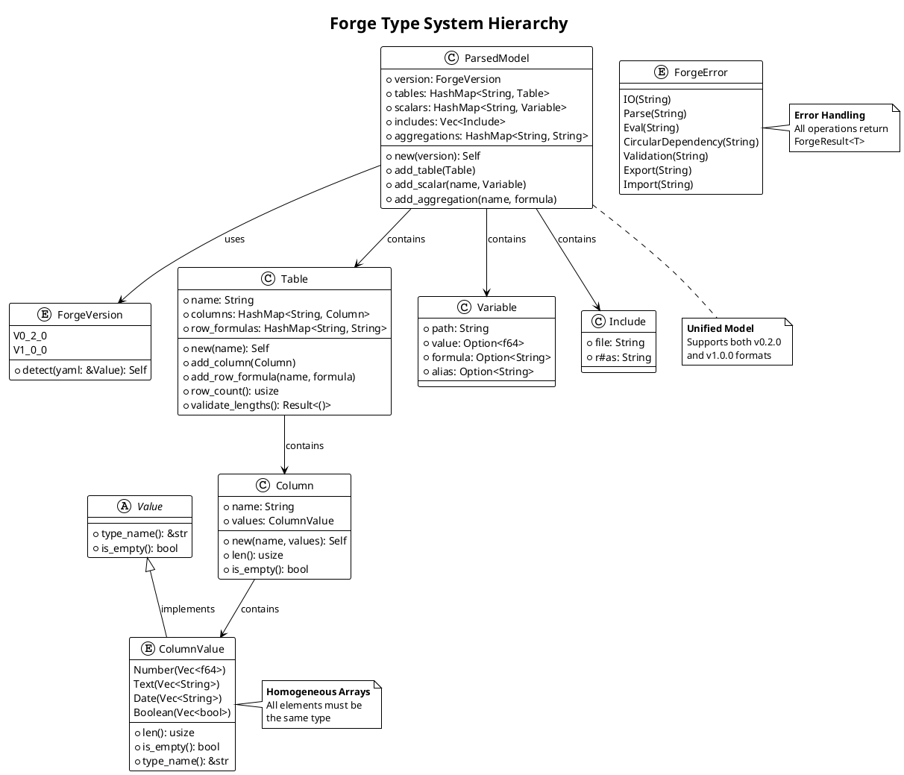
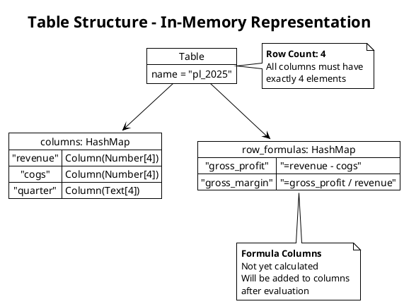
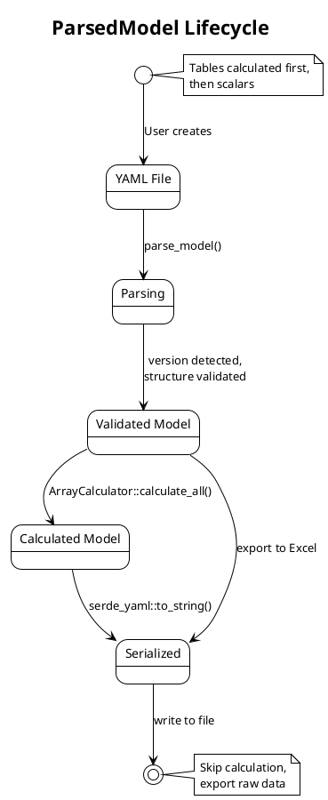
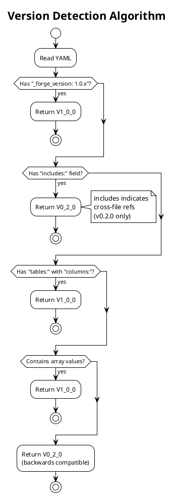
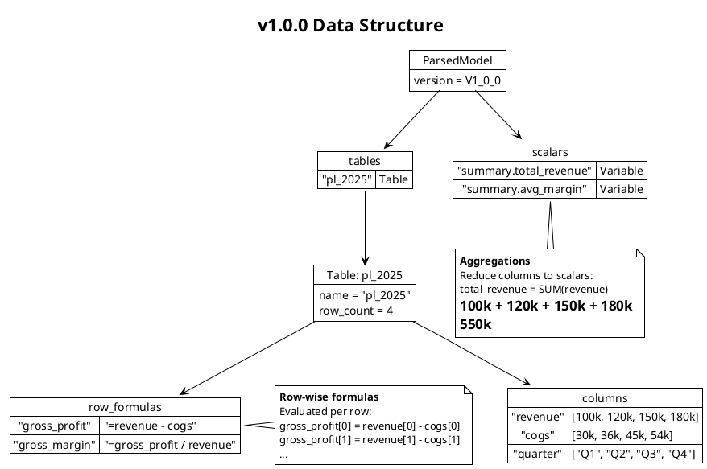
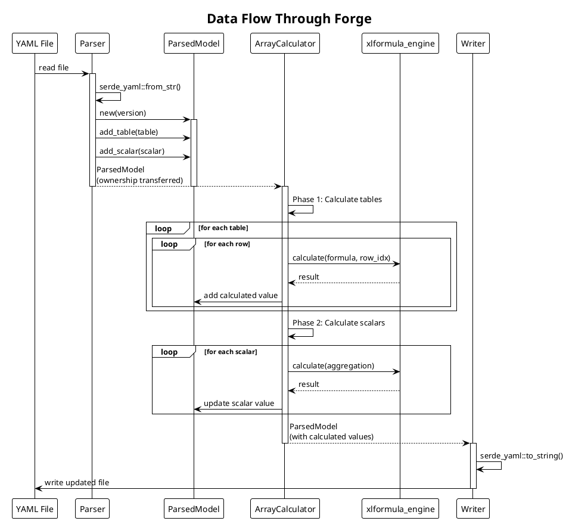
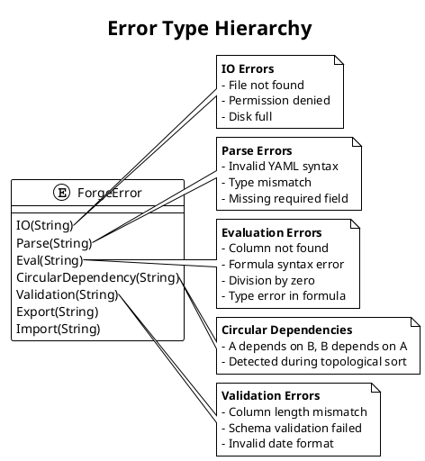

# Data Model Architecture

**Document Version:** 1.0.0
**Forge Version:** v1.1.2
**Last Updated:** 2025-11-24
**Status:** Complete

---

## Table of Contents

1. [Introduction](#introduction)
2. [Type System Overview](#type-system-overview)
3. [Core Data Structures](#core-data-structures)
4. [Version-Specific Models](#version-specific-models)
5. [Type Safety and Invariants](#type-safety-and-invariants)
6. [Data Flow Through System](#data-flow-through-system)
7. [Memory Layout and Performance](#memory-layout-and-performance)
8. [Serialization and Deserialization](#serialization-and-deserialization)
9. [Error Types](#error-types)
10. [Related Documentation](#related-documentation)

---

## Introduction

### Purpose

This document provides a comprehensive specification of Forge's data model, including:

- **Type system** - Enums, structs, and their relationships
- **Data structures** - Tables, columns, and values
- **Invariants** - Type safety guarantees and validation rules
- **Memory model** - Layout, ownership, and performance characteristics
- **Serialization** - YAML and Excel representation

Understanding this data model is essential for:
- **Developers** implementing new features
- **Contributors** fixing bugs or adding functions
- **Architects** evaluating design decisions
- **Users** understanding error messages and limitations

### Design Philosophy

Forge's data model follows these principles:

1. **Type Safety First** - Compile-time guarantees prevent runtime errors
2. **Excel Compatibility** - Data structures map 1:1 to Excel concepts
3. **Homogeneous Arrays** - All elements in a column have the same type
4. **Explicit Over Implicit** - No hidden conversions or magic behavior
5. **Zero-Copy Where Possible** - Minimize allocations and copies

---

## Type System Overview

### Type Hierarchy



### Type Categories

**1. Value Types (Data)**
- `f64` - Floating-point numbers
- `String` - UTF-8 text
- `bool` - Boolean true/false
- ISO date strings (YYYY-MM-DD)

**2. Collection Types**
- `Vec<T>` - Homogeneous arrays
- `HashMap<K, V>` - Key-value mappings
- `Option<T>` - Optional values

**3. Enum Types (Variants)**
- `ForgeVersion` - v0.2.0 or v1.0.0
- `ColumnValue` - Typed column arrays
- `ForgeError` - Error categories

**4. Struct Types (Aggregates)**
- `Column` - Named typed array
- `Table` - Collection of columns
- `ParsedModel` - Complete model
- `Variable` - Scalar value with formula

---

## Core Data Structures

### 1. ColumnValue Enum

**Purpose:** Represent homogeneous arrays of values in table columns.

**Definition:**

```rust
// From: /home/rex/src/utils/forge/src/types.rs:84-121
#[derive(Debug, Clone, PartialEq, Serialize, Deserialize)]
pub enum ColumnValue {
    /// Array of numbers (f64)
    Number(Vec<f64>),
    /// Array of text strings
    Text(Vec<String>),
    /// Array of ISO date strings (YYYY-MM or YYYY-MM-DD)
    Date(Vec<String>),
    /// Array of booleans
    Boolean(Vec<bool>),
}

impl ColumnValue {
    pub fn len(&self) -> usize {
        match self {
            ColumnValue::Number(v) => v.len(),
            ColumnValue::Text(v) => v.len(),
            ColumnValue::Date(v) => v.len(),
            ColumnValue::Boolean(v) => v.len(),
        }
    }

    pub fn is_empty(&self) -> bool {
        self.len() == 0
    }

    pub fn type_name(&self) -> &'static str {
        match self {
            ColumnValue::Number(_) => "Number",
            ColumnValue::Text(_) => "Text",
            ColumnValue::Date(_) => "Date",
            ColumnValue::Boolean(_) => "Boolean",
        }
    }
}
```

**Memory Layout:**

```
ColumnValue::Number(Vec<f64>)
├─ Tag (enum discriminant): 1 byte
├─ Vec metadata:
│  ├─ pointer to heap data: 8 bytes
│  ├─ length: 8 bytes
│  └─ capacity: 8 bytes
└─ Heap data: [f64; len]
   └─ Each f64: 8 bytes

Total stack size: 25 bytes (1 + 24)
Heap size: 8 * len bytes
```

**Examples:**

```yaml
# Number column (quarterly revenue)
revenue:
  - 100000
  - 120000
  - 150000
  - 180000

# Text column (quarter names)
quarter:
  - "Q1 2025"
  - "Q2 2025"
  - "Q3 2025"
  - "Q4 2025"

# Date column (period end dates)
period_end:
  - "2025-03"
  - "2025-06"
  - "2025-09"
  - "2025-12"

# Boolean column (target achieved)
target_met:
  - false
  - true
  - true
  - true
```

**Design Decisions:**

1. **Why separate variants instead of `Vec<Value>`?**
   - Type safety: Prevents mixed types in columns
   - Performance: No runtime type checking needed
   - Memory efficiency: No enum overhead per element

2. **Why f64 for numbers?**
   - Excel uses IEEE 754 double precision
   - xlformula_engine returns f32, we upcast to f64
   - Sufficient precision for financial calculations

3. **Why String for dates instead of chrono::Date?**
   - ISO format is human-readable in YAML
   - Excel exports dates as strings
   - Avoids timezone complexity
   - Easy to validate with regex

### 2. Column Struct

**Purpose:** Named typed array representing a table column.

**Definition:**

```rust
// From: /home/rex/src/utils/forge/src/types.rs:123-142
#[derive(Debug, Clone, Serialize, Deserialize)]
pub struct Column {
    pub name: String,
    pub values: ColumnValue,
}

impl Column {
    pub fn new(name: String, values: ColumnValue) -> Self {
        Self { name, values }
    }

    pub fn len(&self) -> usize {
        self.values.len()
    }

    pub fn is_empty(&self) -> bool {
        self.values.is_empty()
    }
}
```

**Memory Layout:**

```
Column
├─ name: String (24 bytes on stack + heap)
│  ├─ pointer: 8 bytes
│  ├─ length: 8 bytes
│  └─ capacity: 8 bytes
└─ values: ColumnValue (25 bytes + heap)

Total stack size: 49 bytes
Heap size: name.len() + values.heap_size()
```

**Invariants:**

1. **Non-empty name**: Column name must not be empty string
2. **Valid identifier**: Name must match `[a-zA-Z_][a-zA-Z0-9_]*`
3. **Consistent length**: All columns in a table must have same length

**Examples:**

```rust
// Number column
let revenue = Column::new(
    "revenue".to_string(),
    ColumnValue::Number(vec![100000.0, 120000.0, 150000.0, 180000.0])
);

// Text column
let quarters = Column::new(
    "quarter".to_string(),
    ColumnValue::Text(vec![
        "Q1 2025".to_string(),
        "Q2 2025".to_string(),
        "Q3 2025".to_string(),
        "Q4 2025".to_string(),
    ])
);
```

### 3. Table Struct

**Purpose:** Collection of columns representing a worksheet or dataset.

**Definition:**

```rust
// From: /home/rex/src/utils/forge/src/types.rs:144-190
#[derive(Debug, Clone, Serialize, Deserialize)]
pub struct Table {
    pub name: String,
    pub columns: HashMap<String, Column>,
    /// Row-wise formulas (e.g., "profit: =revenue - expenses")
    pub row_formulas: HashMap<String, String>,
}

impl Table {
    pub fn new(name: String) -> Self {
        Self {
            name,
            columns: HashMap::new(),
            row_formulas: HashMap::new(),
        }
    }

    pub fn add_column(&mut self, column: Column) {
        self.columns.insert(column.name.clone(), column);
    }

    pub fn add_row_formula(&mut self, name: String, formula: String) {
        self.row_formulas.insert(name, formula);
    }

    pub fn row_count(&self) -> usize {
        self.columns.values().next().map_or(0, |col| col.len())
    }

    pub fn validate_lengths(&self) -> Result<(), String> {
        let row_count = self.row_count();
        for (name, column) in &self.columns {
            if column.len() != row_count {
                return Err(format!(
                    "Column '{}' has {} rows, expected {} rows",
                    name, column.len(), row_count
                ));
            }
        }
        Ok(())
    }
}
```

**Invariants:**

1. **Unique column names**: No duplicate column names in `columns` or `row_formulas`
2. **Equal row counts**: All columns must have the same length
3. **Valid formulas**: Row formulas must reference existing columns
4. **No self-reference**: Formula column cannot reference itself

**Table Structure Diagram:**



**Examples:**

```yaml
# In YAML format
pl_2025:
  columns:
    revenue: [100000, 120000, 150000, 180000]
    cogs: [30000, 36000, 45000, 54000]
    quarter: ["Q1", "Q2", "Q3", "Q4"]
  row_formulas:
    gross_profit: "=revenue - cogs"
    gross_margin: "=gross_profit / revenue"
```

```rust
// In Rust code
let mut table = Table::new("pl_2025".to_string());

table.add_column(Column::new(
    "revenue".to_string(),
    ColumnValue::Number(vec![100000.0, 120000.0, 150000.0, 180000.0]),
));

table.add_column(Column::new(
    "cogs".to_string(),
    ColumnValue::Number(vec![30000.0, 36000.0, 45000.0, 54000.0]),
));

table.add_row_formula("gross_profit".to_string(), "=revenue - cogs".to_string());
table.add_row_formula("gross_margin".to_string(), "=gross_profit / revenue".to_string());

// Validate all columns have same length
table.validate_lengths().expect("Length mismatch");
```

### 4. ParsedModel Struct

**Purpose:** Unified model supporting both v0.2.0 and v1.0.0 formats.

**Definition:**

```rust
// From: /home/rex/src/utils/forge/src/types.rs:220-265
#[derive(Debug, Serialize, Deserialize)]
pub struct ParsedModel {
    /// Model version detected
    pub version: ForgeVersion,

    /// Tables (v1.0.0 only)
    pub tables: HashMap<String, Table>,

    /// Scalar variables (v0.2.0 compatible, also used in v1.0.0 for summary values)
    pub scalars: HashMap<String, Variable>,

    /// Includes (both versions)
    pub includes: Vec<Include>,

    /// Aggregation formulas (v1.0.0 - formulas that reduce columns to scalars)
    pub aggregations: HashMap<String, String>,
}

impl ParsedModel {
    pub fn new(version: ForgeVersion) -> Self {
        Self {
            version,
            tables: HashMap::new(),
            scalars: HashMap::new(),
            includes: Vec::new(),
            aggregations: HashMap::new(),
        }
    }

    pub fn add_table(&mut self, table: Table) {
        self.tables.insert(table.name.clone(), table);
    }

    pub fn add_scalar(&mut self, name: String, variable: Variable) {
        self.scalars.insert(name, variable);
    }

    pub fn add_aggregation(&mut self, name: String, formula: String) {
        self.aggregations.insert(name, formula);
    }
}
```

**Version-Specific Fields:**

| Field | v0.2.0 | v1.0.0 | Purpose |
|-------|--------|--------|---------|
| `version` | ✓ | ✓ | Version marker |
| `tables` | ✗ | ✓ | Array-based tables |
| `scalars` | ✓ | ✓ | Scalar values |
| `includes` | ✓ | ✗ | Cross-file references |
| `aggregations` | ✗ | ✓ | Column → scalar formulas |

**Model Lifecycle:**



### 5. Variable Struct (v0.2.0 Scalars)

**Purpose:** Scalar value with optional formula and cross-file reference.

**Definition:**

```rust
// From: /home/rex/src/utils/forge/src/types.rs:203-211
#[derive(Debug, Clone, Serialize, Deserialize)]
pub struct Variable {
    pub path: String,
    pub value: Option<f64>,
    pub formula: Option<String>,
    /// The alias of the file this variable came from (None for main file)
    pub alias: Option<String>,
}
```

**Fields:**

- `path` - Fully qualified path (e.g., "financials.revenue.q1")
- `value` - Calculated numeric value
- `formula` - Excel-style formula (e.g., "=@pricing.base * qty")
- `alias` - File alias for cross-file references (e.g., "pricing")

**Examples:**

```yaml
# In YAML (v0.2.0)
revenue:
  value: 1000000
  formula: "=@pricing.base_price * volume"

# In YAML (v1.0.0 scalar)
summary:
  total_revenue:
    value: 550000
    formula: "=SUM(pl_2025.revenue)"
```

```rust
// In Rust code
let revenue = Variable {
    path: "financials.revenue".to_string(),
    value: Some(1000000.0),
    formula: Some("=@pricing.base_price * volume".to_string()),
    alias: None,
};

let imported_var = Variable {
    path: "pricing.base_price".to_string(),
    value: Some(99.0),
    formula: None,
    alias: Some("pricing".to_string()),
};
```

### 6. ForgeVersion Enum

**Purpose:** Distinguish between v0.2.0 (scalar) and v1.0.0 (array) models.

**Definition:**

```rust
// From: /home/rex/src/utils/forge/src/types.rs:8-77
#[derive(Debug, Clone, Copy, PartialEq, Eq, Serialize, Deserialize)]
pub enum ForgeVersion {
    /// v0.2.0 - Scalar model (discrete values with {value, formula})
    V0_2_0,
    /// v1.0.0 - Array model (column arrays for Excel compatibility)
    V1_0_0,
}

impl ForgeVersion {
    pub fn detect(yaml: &serde_yaml::Value) -> Self {
        // 1. Check for explicit version marker
        if let Some(version_val) = yaml.get("_forge_version") {
            if let Some(version_str) = version_val.as_str() {
                if version_str.starts_with("1.0") {
                    return ForgeVersion::V1_0_0;
                }
            }
        }

        // 2. Check for v0.2.0 specific features (includes field)
        if yaml.get("includes").is_some() {
            return ForgeVersion::V0_2_0;
        }

        // 3. Check for v1.0.0 specific features (tables with columns)
        if let Some(tables_val) = yaml.get("tables") {
            if let Some(tables_map) = tables_val.as_mapping() {
                for (_table_name, table_val) in tables_map {
                    if let Some(table_map) = table_val.as_mapping() {
                        if table_map.contains_key("columns") {
                            return ForgeVersion::V1_0_0;
                        }
                    }
                }
            }
        }

        // 4. Check for array pattern (v1.0.0 indicator)
        if Self::has_array_values(yaml) {
            return ForgeVersion::V1_0_0;
        }

        // 5. Default to v0.2.0 for backwards compatibility
        ForgeVersion::V0_2_0
    }
}
```

**Detection Algorithm:**



---

## Version-Specific Models

### v0.2.0 Scalar Model

**Characteristics:**
- Discrete scalar values
- Cross-file references via `includes`
- Formula syntax: `=@alias.variable`
- No arrays or tables

**YAML Structure:**

```yaml
# main.yaml
includes:
  - file: pricing.yaml
    as: pricing
  - file: costs.yaml
    as: costs

revenue:
  value: null
  formula: "=@pricing.base_price * volume"

volume:
  value: 1000
  formula: null

profit:
  value: null
  formula: "=revenue - @costs.total"
```

**Data Flow:**

```
pricing.yaml (base_price=99) ──┐
                                ├──> revenue = 99 * 1000 = 99000
volume=1000 ────────────────────┘

revenue=99000 ──┐
                ├──> profit = 99000 - 5000 = 94000
costs.yaml (total=5000) ────┘
```

### v1.0.0 Array Model

**Characteristics:**
- Column arrays for tables
- Row-wise formulas (element-wise operations)
- Aggregation formulas (column → scalar)
- Excel-compatible structure

**YAML Structure:**

```yaml
_forge_version: "1.0.0"

pl_2025:
  columns:
    revenue: [100000, 120000, 150000, 180000]
    cogs: [30000, 36000, 45000, 54000]
    quarter: ["Q1", "Q2", "Q3", "Q4"]
  row_formulas:
    gross_profit: "=revenue - cogs"
    gross_margin: "=gross_profit / revenue"

summary:
  total_revenue:
    value: null
    formula: "=SUM(pl_2025.revenue)"
  avg_margin:
    value: null
    formula: "=AVERAGE(pl_2025.gross_margin)"
```

**Data Structure:**



---

## Type Safety and Invariants

### Compile-Time Guarantees

**1. Homogeneous Arrays**

```rust
// ✓ Allowed - all f64
let numbers = ColumnValue::Number(vec![1.0, 2.0, 3.0]);

// ✗ Prevented by Rust type system - cannot mix types
// let mixed = ColumnValue::Number(vec![1.0, "text", true]);
//                                       ^^^  ^^^^^^  ^^^^
//                                       f64  &str    bool
// Compiler error: mismatched types
```

**2. Ownership and Borrowing**

```rust
// Calculator takes ownership of model
let calculator = ArrayCalculator::new(model);  // model moved

// Cannot use model here - ownership transferred
// let x = model.tables;  // Compiler error: value borrowed after move

// Get model back with calculated values
let calculated_model = calculator.calculate_all()?;  // ownership returned
```

**3. Option Types for Null Safety**

```rust
pub struct Variable {
    pub value: Option<f64>,       // May or may not have a value
    pub formula: Option<String>,  // May or may not have a formula
}

// Explicit handling required
match variable.value {
    Some(v) => println!("Value: {}", v),
    None => println!("No value yet"),
}
```

### Runtime Invariants

**1. Column Length Consistency**

```rust
// From: /home/rex/src/utils/forge/src/types.rs:176-189
pub fn validate_lengths(&self) -> Result<(), String> {
    let row_count = self.row_count();
    for (name, column) in &self.columns {
        if column.len() != row_count {
            return Err(format!(
                "Column '{}' has {} rows, expected {} rows",
                name, column.len(), row_count
            ));
        }
    }
    Ok(())
}
```

**Enforcement:**
- Called after parsing (parser/mod.rs:97-101)
- Called before calculation
- User sees clear error: "Column 'profit' has 3 rows, expected 4 rows"

**2. No Circular Dependencies**

```rust
// Detected by petgraph topological sort
let order = toposort(&graph, None).map_err(|_| {
    ForgeError::CircularDependency(
        "Circular dependency detected between tables".to_string()
    )
})?;
```

**Examples:**
```
✗ Invalid: revenue depends on profit, profit depends on revenue
  revenue: =profit * 1.2
  profit: =revenue - costs

✓ Valid: Linear dependency chain
  revenue: 100000
  costs: 30000
  profit: =revenue - costs
```

**3. Formula Column References**

```rust
// From: /home/rex/src/utils/forge/src/core/array_calculator.rs:292-307
if let Some(col) = table.columns.get(col_ref) {
    if col.values.len() != row_count {
        return Err(ForgeError::Eval(format!(
            "Column '{}' has {} rows, expected {}",
            col_ref, col.values.len(), row_count
        )));
    }
} else {
    return Err(ForgeError::Eval(format!(
        "Column '{}' not found in table",
        col_ref
    )));
}
```

**Enforcement:**
- Before formula evaluation
- Checks all referenced columns exist
- Validates row counts match

### Type Coercion Rules

**Forge NEVER implicitly converts types.**

```yaml
# ✗ Invalid - mixed types in column
revenue:
  - 100000      # Number
  - "Q2"        # Text
  - true        # Boolean

# Parser error: "Expected Number, found Text"
```

**xlformula_engine handles conversions:**

```rust
// Excel-style type coercion (inside xlformula_engine)
=IF(revenue > 100000, "High", "Low")  // Number → Boolean, result is Text
=TEXT(date, "YYYY-MM")                // Date → Text
=VALUE("123.45")                      // Text → Number
```

**Forge preserves result types:**

```rust
// Formula returns Text
let result = calculate("=IF(revenue > 100000, \"High\", \"Low\")", ...)?;

// Store as Text column
ColumnValue::Text(vec!["High".to_string(), "Low".to_string(), ...])
```

---

## Data Flow Through System

### Parse → Calculate → Write Pipeline



### Memory Ownership Transfer

```rust
// 1. Parser creates and owns ParsedModel
let model: ParsedModel = parse_model(&file)?;

// 2. Calculator takes ownership
let calculator = ArrayCalculator::new(model);  // model moved

// 3. Calculator returns ownership with calculated values
let calculated_model = calculator.calculate_all()?;  // ownership returned

// 4. Writer borrows model (doesn't take ownership)
write_model(&file, &calculated_model)?;  // borrow

// 5. Model still available for other operations
export_to_excel(&calculated_model, &excel_file)?;
```

**Why this pattern?**
- **Efficiency**: No unnecessary clones
- **Safety**: Cannot use model while being calculated
- **Clarity**: Explicit ownership transfer

---

## Memory Layout and Performance

### Stack vs Heap Allocation

**ParsedModel Layout:**

```
ParsedModel (stack)
├─ version: ForgeVersion              8 bytes (enum + padding)
├─ tables: HashMap<String, Table>     48 bytes (3 pointers)
├─ scalars: HashMap<String, Variable> 48 bytes
├─ includes: Vec<Include>             24 bytes
└─ aggregations: HashMap<...>         48 bytes

Total stack: ~176 bytes
Heap: All strings, vectors, hashmaps
```

**Table Layout:**

```
Table (stack)
├─ name: String                       24 bytes
├─ columns: HashMap<String, Column>   48 bytes
└─ row_formulas: HashMap<...>         48 bytes

Total stack: ~120 bytes
Heap: name string + all columns + formulas
```

**Column Layout:**

```
Column (stack)
├─ name: String                       24 bytes
└─ values: ColumnValue                25 bytes
   ├─ enum discriminant               1 byte
   └─ Vec<T>                          24 bytes

Total stack: ~49 bytes
Heap: name string + Vec data
```

### Performance Characteristics

**Time Complexity:**

| Operation | Best Case | Average Case | Worst Case |
|-----------|-----------|--------------|------------|
| `parse_model()` | O(n) | O(n) | O(n) |
| `validate_lengths()` | O(c) | O(c) | O(c) |
| `calculate_all()` | O(t + s) | O(t·r + s) | O(t·r·f + s) |
| `export()` | O(t·r·c) | O(t·r·c) | O(t·r·c) |

Where:
- n = size of YAML file
- c = number of columns
- t = number of tables
- r = rows per table
- s = number of scalars
- f = complexity of formula

**Space Complexity:**

| Structure | Stack | Heap | Total |
|-----------|-------|------|-------|
| `ParsedModel` | 176 bytes | O(t + s) | O(t·r·c + s) |
| `Table` | 120 bytes | O(c·r) | O(c·(r + name_len)) |
| `Column` | 49 bytes | O(r + name_len) | O(r·sizeof(T)) |

**Memory Optimization Strategies:**

1. **String Interning** (not yet implemented)
   ```rust
   // Current: Each column name is a separate String
   // Future: Use Rc<str> for shared strings
   pub struct Column {
       pub name: Rc<str>,  // Shared reference
       pub values: ColumnValue,
   }
   ```

2. **Copy-on-Write** (used in calculator)
   ```rust
   // Clone only when needed
   let table = self.model.tables.get(&table_name).unwrap().clone();
   ```

3. **Streaming Serialization** (future optimization)
   ```rust
   // Current: Load entire model into memory
   // Future: Stream large tables to disk
   ```

---

## Serialization and Deserialization

### YAML Serialization

**Serde Integration:**

```rust
#[derive(Debug, Clone, Serialize, Deserialize)]
pub struct Table {
    pub name: String,
    pub columns: HashMap<String, Column>,
    pub row_formulas: HashMap<String, String>,
}
```

**YAML Representation:**

```yaml
pl_2025:
  columns:
    revenue:
      - 100000
      - 120000
      - 150000
    cogs:
      - 30000
      - 36000
      - 45000
  row_formulas:
    profit: "=revenue - cogs"
```

**Custom Serialization (future):**

```rust
// Custom serializer for compact representation
impl Serialize for Column {
    fn serialize<S>(&self, serializer: S) -> Result<S::Ok, S::Error>
    where
        S: Serializer,
    {
        // Serialize as just the values array, not the full struct
        self.values.serialize(serializer)
    }
}
```

### Excel Serialization

**rust_xlsxwriter Integration:**

```rust
// From: /home/rex/src/utils/forge/src/excel/exporter.rs:99-122
for row_idx in 0..row_count {
    let excel_row = (row_idx + 1) as u32 + 1;  // Excel is 1-indexed

    for (col_idx, col_name) in column_names.iter().enumerate() {
        if let Some(formula) = table.row_formulas.get(col_name) {
            // Write formula
            let excel_formula = translator.translate_row_formula(formula, excel_row)?;
            worksheet.write_formula(excel_row - 1, col_idx as u16,
                                    Formula::new(&excel_formula))?;
        } else if let Some(column) = table.columns.get(col_name) {
            // Write data value
            self.write_cell_value(worksheet, excel_row - 1, col_idx as u16,
                                  &column.values, row_idx)?;
        }
    }
}
```

**Type Mapping:**

| Forge Type | Excel Type | Serialization |
|------------|-----------|---------------|
| `Number(f64)` | Number | `worksheet.write_number()` |
| `Text(String)` | String | `worksheet.write_string()` |
| `Date(String)` | String | `worksheet.write_string()` (ISO format) |
| `Boolean(bool)` | Boolean | `worksheet.write_boolean()` |
| Formula | Formula | `worksheet.write_formula()` |

---

## Error Types

### ForgeError Enum

**Definition:**

```rust
// From: /home/rex/src/utils/forge/src/error.rs:1-33
use thiserror::Error;

#[derive(Error, Debug)]
pub enum ForgeError {
    #[error("IO error: {0}")]
    IO(String),

    #[error("Parse error: {0}")]
    Parse(String),

    #[error("Evaluation error: {0}")]
    Eval(String),

    #[error("Circular dependency: {0}")]
    CircularDependency(String),

    #[error("Validation error: {0}")]
    Validation(String),

    #[error("Export error: {0}")]
    Export(String),

    #[error("Import error: {0}")]
    Import(String),
}

pub type ForgeResult<T> = Result<T, ForgeError>;

// Automatic conversions
impl From<std::io::Error> for ForgeError {
    fn from(err: std::io::Error) -> Self {
        ForgeError::IO(err.to_string())
    }
}

impl From<serde_yaml::Error> for ForgeError {
    fn from(err: serde_yaml::Error) -> Self {
        ForgeError::Parse(err.to_string())
    }
}
```

### Error Hierarchy



### Error Usage Examples

```rust
// IO error (automatic conversion)
let content = std::fs::read_to_string(&path)?;  // ForgeError::IO

// Parse error (automatic conversion)
let yaml: Value = serde_yaml::from_str(&content)?;  // ForgeError::Parse

// Validation error (manual)
if column.len() != row_count {
    return Err(ForgeError::Validation(format!(
        "Column '{}' has {} rows, expected {}",
        name, column.len(), row_count
    )));
}

// Evaluation error (manual)
if !table.columns.contains_key(col_name) {
    return Err(ForgeError::Eval(format!(
        "Column '{}' not found in table",
        col_name
    )));
}

// Circular dependency (from petgraph)
let order = toposort(&graph, None).map_err(|_| {
    ForgeError::CircularDependency(
        "Circular dependency detected".to_string()
    )
})?;
```

---

## Related Documentation

### Architecture Deep Dives

- [00-OVERVIEW.md](00-OVERVIEW.md) - High-level architecture
- [01-COMPONENT-ARCHITECTURE.md](01-COMPONENT-ARCHITECTURE.md) - Component interactions
- [03-FORMULA-EVALUATION.md](03-FORMULA-EVALUATION.md) - Calculation pipeline
- [04-DEPENDENCY-RESOLUTION.md](04-DEPENDENCY-RESOLUTION.md) - Graph algorithms
- [05-EXCEL-INTEGRATION.md](05-EXCEL-INTEGRATION.md) - Excel conversion
- [06-CLI-ARCHITECTURE.md](06-CLI-ARCHITECTURE.md) - Command structure
- [07-TESTING-ARCHITECTURE.md](07-TESTING-ARCHITECTURE.md) - Test strategy

### Source Files Referenced

- `/home/rex/src/utils/forge/src/types.rs` - All data structures
- `/home/rex/src/utils/forge/src/error.rs` - Error types
- `/home/rex/src/utils/forge/src/parser/mod.rs` - Deserialization
- `/home/rex/src/utils/forge/src/writer/mod.rs` - Serialization
- `/home/rex/src/utils/forge/src/excel/exporter.rs` - Excel serialization

---

**Previous:** [← Component Architecture](01-COMPONENT-ARCHITECTURE.md)
**Next:** [Formula Evaluation →](03-FORMULA-EVALUATION.md)
